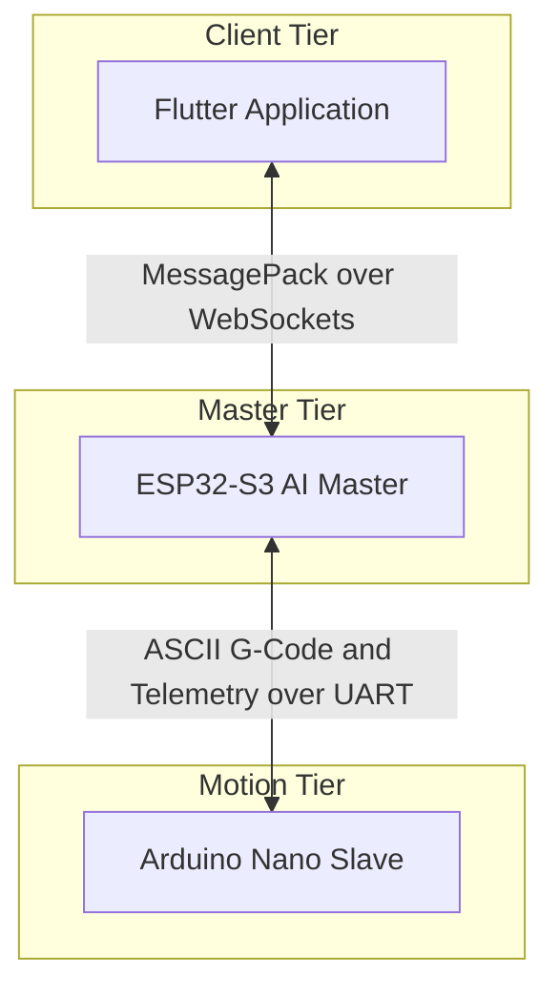
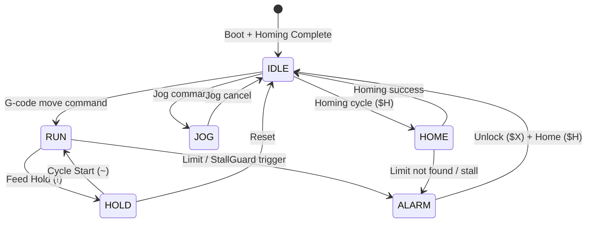
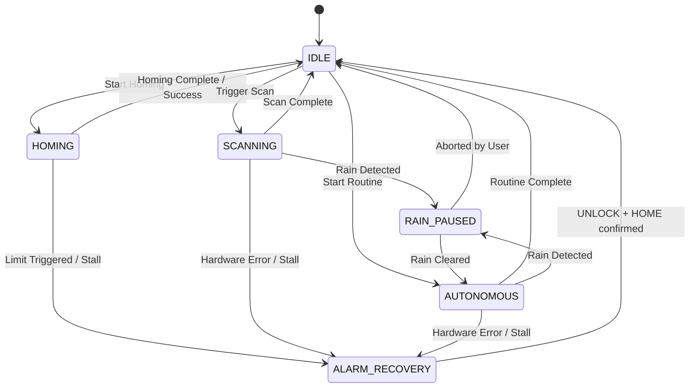

# Agri3D System Master Plan & Architecture Guide

Welcome to the **Agri3D Cartesian Gantry System (Mark 2)** master plan repository. This directory serves as the documentation and design hub for the entire project.

> Last updated: July 2026 — Joshua & Kent, AGRI_3D Mark 2

---

## 1. System Topology

The system is split into three decoupled tiers:



---

## 2. Project Directory Structure

```text
AGRI_3D-App_Mark2/
├── masterplan/                 # High-level architecture, design specifications, and guides
│   └── README.md               # This file
│
├── communication/              # MessagePack contract schema and compilation tools
│   ├── protocol_schema.json    # The human-readable communication schema (source of truth)
│   └── sync_contracts.py       # Code generator: C++ structs + Dart model classes
│
├── AI-Agri3D/                  # ESP32-S3 Master controller firmware (FreeRTOS/PlatformIO)
│   └── lib/
│       ├── agri3d_ai/          # Edge Impulse FOMO crop-weed detection
│       ├── agri3d_fuzzy/       # Mamdani Fuzzy dosing logic
│       └── xgboost_model/      # Compiled XGBoost regression model
│
├── GRBL-AGRI3D/                # Arduino Nano motion controller firmware (GRBL Fork)
│   └── src/
│       ├── machine_config.h    # Single source of truth for all GRBL $ settings
│       ├── tmc_config.c        # TMC2209 UART-mode driver configuration
│       ├── tmc_report.c        # Custom telemetry injector (|TMC:...|RELAYS:...)
│       └── relays.c            # M100-M107 relay/actuator M-code handlers
│
└── agri3d_flutter/             # Cross-platform Flutter user interface application
    ├── lib/
    │   ├── models/             # Generated from sync_contracts.py -- DO NOT hand-edit
    │   ├── providers/          # Riverpod state providers
    │   └── screens/            # UI screens
    └── pubspec.yaml
```

---

## 3. State-Centric Architecture & State Blockers

Both the Master (ESP32-S3) and the Slave (Arduino Nano) are designed as **State-Centric State Machines** to ensure safety, predictable behavior, and clean recovery paths. Every subsystem has an explicit **blocker table** — a contract of what is allowed and what is rejected in each state.

---

### A. Arduino Nano (Motion Engine) States

The Nano operates standard GRBL states: `IDLE`, `RUN`, `HOLD`, `JOG`, `HOME`, `ALARM`.



#### Nano State Blocker Table

If a command arrives outside its allowed states, the Nano must **log a warning** and **silently discard** it. Never partially execute a blocked command.

| State    | Move Commands | M100-M105 Relays  | M106/M107 Head State | Status Poll (?) |
|----------|--------------|-------------------|-----------------------|-----------------|
| `IDLE`   | YES          | YES               | YES                   | YES             |
| `RUN`    | YES          | **BLOCKED**       | YES                   | YES             |
| `HOLD`   | Queued       | YES               | YES                   | YES             |
| `JOG`    | YES          | **BLOCKED**       | YES                   | YES             |
| `HOME`   | **BLOCKED**  | **BLOCKED**       | **BLOCKED**           | YES             |
| `ALARM`  | **BLOCKED**  | **BLOCKED**       | **BLOCKED**           | YES             |

> **ALARM Rule**: On entering `ALARM`, the Nano must atomically: (1) stop all motion, (2) force all relay pins LOW (OFF), (3) set `head_is_down = true` (conservative assumption), and (4) send an alarm report over serial.

---

### B. ESP32-S3 (Orchestration Engine) States



#### ESP32 Operation State Blocker Table

The ESP32 checks its own `OperationState` **before** forwarding any command to the Nano. If blocked, it replies to Flutter with a `CMD_REJECTED` MessagePack message including a reason code — **never silently discard operator commands**.

| State              | Send G-Code to Nano   | Trigger Relays     | WebSocket Commands      | Start AI Scan   | Start Routine   | Camera Stream |
|--------------------|----------------------|--------------------|--------------------------|----------------|----------------|---------------|
| `IDLE`             | YES                  | YES                | YES (all)               | YES            | YES            | YES           |
| `HOMING`           | YES (homing only)    | **BLOCKED**        | YES (status only)       | **BLOCKED**    | **BLOCKED**    | YES           |
| `SCANNING`         | YES (scan moves)     | **BLOCKED**        | YES (status + abort)    | Already running| **BLOCKED**    | YES           |
| `AUTONOMOUS`       | YES (routine only)   | YES (routine steps)| YES (status + abort)    | **BLOCKED**    | Already running| YES           |
| `RAIN_PAUSED`      | **BLOCKED**          | **BLOCKED**        | YES (status + abort)    | **BLOCKED**    | **BLOCKED**    | YES           |
| `ALARM_RECOVERY`   | **BLOCKED**          | **BLOCKED**        | YES (status + unlock)   | **BLOCKED**    | **BLOCKED**    | **BLOCKED**   |

---

### C. Flutter App Connection States

Flutter must maintain its own connection state machine. The UI reflects the **real** connection state — never assume connectivity.

#### Flutter Connection State Blocker Table

| State          | Show Controls     | Send Commands     | Show Live Data    | Auto-Reconnect |
|----------------|-------------------|-------------------|-------------------|----------------|
| `Disconnected` | Hidden            | **BLOCKED**       | Hidden            | YES (searching)|
| `Connecting`   | Hidden            | **BLOCKED**       | Hidden            | —              |
| `Connected`    | YES               | YES               | YES               | —              |
| `Reconnecting` | YES (greyed out)  | Queued locally    | Stale data shown  | YES (active)   |

> **Anti-Ghost Rule**: If Flutter receives no `STATE_UPDATE` or telemetry for **5 seconds**, it must automatically transition to `Reconnecting`, close the stale socket, and restart mDNS/UDP discovery. Never leave a zombie connection open.

> **Debounce Rule**: All motion buttons must be debounced with a minimum 300ms cooldown after any tap to prevent duplicate command flooding.

---

### D. Master Safety Rules

1. **Rain Gating**: Rain sensor or weather API precipitation triggers immediate `Feed Hold` to Nano, raises NPK probe, enters `RAIN_PAUSED`.
2. **Watchdog Check**: Nano not responding for 4+ poll cycles (50ms in motion, 250ms idle) triggers `ALARM_RECOVERY` and halts all automated tasks.
3. **Client Disconnection**: WebSocket link broken disables live camera stream and pauses non-autonomous tasks.
4. **Singleton WebSocket**: All secondary connection attempts are rejected immediately with a `SINGLE_CLIENT_ONLY` binary payload.
5. **Ping-Pong Watchdog**: 2-second ping interval. 10 consecutive failed pongs forces socket close and resets all state variables to idle defaults.
6. **Serial Flush**: UART RX/TX buffers are flushed on Nano connect AND alarm recovery to clear ghost commands.

---

## 4. Z-Axis Ground Interlock (Plant Safety Critical)

> **Mark 1 Problem**: No software lock prevented XY movement when the head was near ground level. A mis-timed XY jog dragged the nozzle across the soil and damaged plants.

### Three-Layer Ground Interlock

#### Layer 1 -- GRBL Firmware (`motion_control.c`)

Inject into `mc_line()` before executing any move:

```c
// Time Complexity: O(1) -- single position comparison
// Space Complexity: O(1) -- no allocations
if (agri3d_is_xy_move(target)) {
    if (sys_position[Z_AXIS] < (Z_SAFE_TRAVEL_MM * settings.steps_per_mm[Z_AXIS])
        || agri3d_head_is_down()) {
        system_set_exec_alarm(EXEC_ALARM_HARD_LIMIT);
        report_feedback_message(MESSAGE_PROGRAM_END);
        return; // DROP the move entirely
    }
}
```

#### Layer 2 -- Custom M-Codes `M106` / `M107`

| M-Code | Meaning           | Effect                                     |
|--------|-------------------|--------------------------------------------|
| `M106` | Head **raised**   | Clears interlock latch -- XY now permitted |
| `M107` | Head **lowered**  | Sets interlock latch -- XY now BLOCKED     |

> **Boot Default**: `head_is_down = true` on power-on. XY moves are BLOCKED until homing completes and the ESP32 explicitly issues `M106`.

#### Layer 3 -- ESP32 Master Sequence

```
CORRECT sequence:
  G91 G0 Z5         (Raise head above safe height)
  M106              (Declare head raised)
  G90 G0 X100 Y50   (XY travel -- now allowed)
  G91 G0 Z-5       (Lower head to work position)
  M107              (Declare head down)

WRONG (Mark 1 pattern):
  G0 X100 Y50       (XY move with Z unknown -- plant drag risk)
```

---

## 5. Canonical Machine Configuration (`machine_config.h`)

All GRBL `$` settings live in **one file**: `GRBL-AGRI3D/src/machine_config.h`. Never hardcode machine parameters anywhere else.

Key constants defined here:
- Steps/mm per axis (`$100`-`$102`)
- Max feed rates (`$110`-`$112`)
- Acceleration (`$120`-`$122`)
- Travel limits (`$130`-`$132`)
- `DIR_INVERT_MASK` -- which motors are wired backwards
- `LIMIT_PINS_INVERT` -- always 0 (use NC switches only)
- `HOMING_DIR_INVERT` -- Z homes upward on our machine
- `Z_SAFE_TRAVEL_MM` -- ground interlock threshold
- `AGRI3D_CONFIG_VERSION` -- bump this when hardware changes

On boot, firmware checks the stored config version byte in EEPROM. If it doesn't match `AGRI3D_CONFIG_VERSION`, all settings are re-written automatically. **No more lost configs after reflashing.**

> **NC Switch Rule**: ALWAYS use Normally Closed (NC) limit switches. A broken wire on NC looks triggered -- machine stops. A broken wire on NO looks untriggered -- machine drives into the frame.

---

## 6. Communication Architecture

### A. ESP32-S3 to Flutter (MessagePack over WebSocket)

- **Protocol**: MessagePack frames with integer keys (`{0: wifiState, 1: x}`)
- **Schema**: `communication/protocol_schema.json` is the single source of truth
- **Code Gen**: Run `sync_contracts.py` to regenerate C++ and Dart contracts -- never hand-write protocol classes
- **CRC16**: Every frame carries a Modbus CRC16 checksum. Mismatched frames are dropped immediately
- **Debug Mode**: `#define DEBUG_MSGPACK` on the ESP32 pretty-prints all payloads to the Serial console

#### MessagePack Key Registry

| Key | Field            | Type   | Notes                         |
|-----|------------------|--------|-------------------------------|
| `0` | `wifiState`      | uint8  | 0=Disconnected, 1=AP, 2=STA   |
| `1` | `operationState` | uint8  | ESP32 OperationState enum     |
| `2` | `nanoState`      | uint8  | Maps to GRBL state            |
| `3` | `mpos_x`         | float  | Machine X position (mm)       |
| `4` | `mpos_y`         | float  | Machine Y position (mm)       |
| `5` | `mpos_z`         | float  | Machine Z position (mm)       |
| `10`| `SCAN_START`     | uint8  | ESP32 to Flutter notification |
| `11`| `SCAN_COMPLETE`  | uint8  | Includes bounding box array   |
| `12`| `UPLOAD_SCAN_START`| uint8| Flutter triggers cloud upload |
| `20`| `DOSING_COMMAND` | uint8  | Fuzzy output to relay command |

### B. ESP32-S3 to Arduino Nano (ASCII G-Code over UART)

- **Baud Rate**: 115200
- **Extended Status Format**: `<State|MPos:x,y,z|TMC:a,b,c,d|RELAYS:r1,r2>`
- **Flow Control**: Atomic command-response -- wait for `ok` or `error:N` before sending next command

---

## 7. Code Quality Rules (Mandatory for All Files)

### Big-O Documentation
Every function, class, or script must include in its header comment:
```c
// Time Complexity:  O(n) -- iterates over all relay channels
// Space Complexity: O(1) -- no heap allocation
```

### Naming Conventions

| Layer         | Convention       | Example                    |
|---------------|------------------|----------------------------|
| C/C++ functions | `snake_case`   | `tmc_get_stall_status()`   |
| Dart classes  | `PascalCase`     | `MotionStatusMessage`      |
| Dart variables| `camelCase`      | `wifiState`                |
| MessagePack keys | Integer constants | `const int KEY_WIFI_STATE = 0` |
| FreeRTOS tasks | `UPPER_SNAKE_CASE` | `TASK_SERIAL_HANDLER`   |

### No Magic Numbers
```c
// BAD
if (sys.state == 3) { ... }

// GOOD
if (sys.state == STATE_IDLE) { ... }
```

---

## 8. Development Workflow

1. **Define protocol changes in `protocol_schema.json` first** -- before writing any code
2. **Run `sync_contracts.py`** to regenerate C++ and Dart contracts
3. **Implement firmware** (ESP32 / Nano) against the generated headers
4. **Implement Flutter UI** against the generated Dart models
5. **Test communication** with a local WebSocket mock before touching hardware
6. **Document Big-O** before merging any PR

---

## 9. Priority Checklist

| Priority   | Task                                                                  |
|------------|-----------------------------------------------------------------------|
| CRITICAL   | Switch to MessagePack + CRC16                                        |
| CRITICAL   | Singleton WebSocket + ping watchdog                                  |
| CRITICAL   | Nano relay state guards (IDLE/HOLD only)                             |
| CRITICAL   | Z-axis ground interlock in `mc_line()`                               |
| CRITICAL   | Boot default: `head_is_down = true` until homing                    |
| CRITICAL   | ESP32 operation state blocker table enforced                         |
| CRITICAL   | Flutter connection state machine (no zombie sockets)                 |
| HIGH       | Adaptive `?` polling with one-in-flight rule (prevent UART flooding)|
| HIGH       | Position cache + fixed-rate WebSocket push (decouple UART from UI)  |
| HIGH       | `machine_config.h` single source of truth                           |
| HIGH       | Auto-write EEPROM on boot with version check                        |
| HIGH       | NC limit switches only -- rewire any NO switches                    |
| HIGH       | Direction flag commissioning checklist (do once, document)          |
| HIGH       | FreeRTOS task isolation on ESP32                                     |
| HIGH       | Serial flush on connect/alarm                                        |
| HIGH       | Riverpod state management in Flutter                                 |
| MEDIUM     | Modularize AI subsystem headers (ai, fuzzy, xgboost)                |
| MEDIUM     | Delete A4988 legacy configs                                          |
| MEDIUM     | `CMD_REJECTED` MessagePack error responses from ESP32               |
| LOW        | Big-O documentation sweep                                            |
| LOW        | Flutter outdoor UI polish (dark mode, 56dp touch targets)           |

---

## 10. Real-Time Position Telemetry Protocol

### The Problem (Mark 1)

In Mark 1, the ESP32 polled the Nano with `?` at a fixed rate regardless of machine state and forwarded every response directly to Flutter. This caused two failure modes:

1. **UART flooding**: Polling faster than the Nano could respond caused the UART RX buffer to overflow, dropping status bytes mid-parse and producing corrupt position readings.
2. **WebSocket flooding**: Every UART poll triggered a WebSocket push, so rapid polling also congested the Wi-Fi link to Flutter -- especially during JPEG streaming.

### Root Cause

The ESP32 coupled two things that must be **completely decoupled**:

- **How often it polls the Nano** (UART rate -- hardware-constrained)
- **How often it pushes position to Flutter** (WebSocket rate -- UI-constrained)

When these are the same loop, adding G-code command traffic on top of status polling overflows the serial buffer even at 115200 baud.

---

### The Fix: Three Rules

#### Rule 1 -- One `?` In Flight at a Time

The ESP32 must **never send a second `?`** until the full response to the first has been received and parsed. A single atomic boolean `status_poll_pending` inside `TASK_SERIAL` enforces this:

```c
// Time Complexity: O(1) -- single flag check per poll tick
// Space Complexity: O(1) -- one boolean
static volatile bool status_poll_pending = false;

void grbl_request_status(void) {
    if (status_poll_pending) return;  // previous response not yet received -- SKIP
    status_poll_pending = true;
    uart_write_bytes(UART_NUM_1, "?", 1);
}

void grbl_on_status_received(const char* status_line) {
    grbl_parse_status(status_line);  // update position cache
    status_poll_pending = false;      // allow next poll
}
```

> This single rule eliminates the majority of UART flooding. The buffer can only ever hold one unanswered query at a time.

#### Rule 2 -- Adaptive Poll Interval (State-Aware)

The poll rate adapts to the Nano's current state. There is no reason to poll 20x/sec when the machine is stationary.

| Nano State | Poll Interval | Reasoning |
|---|---|---|
| `IDLE` | 500 ms | Position is not changing |
| `HOLD` | 500 ms | Machine is paused |
| `ALARM` | 1000 ms | Just confirming it is alive |
| `HOME` | 100 ms | Homing is controlled and predictable |
| `RUN` | 50 ms | Active coordinated motion |
| `JOG` | 50 ms | Operator-driven, needs responsiveness |

```c
// Time Complexity: O(1) -- switch on enum value
// Space Complexity: O(1)
uint32_t grbl_get_poll_interval_ms(grbl_state_t state) {
    switch (state) {
        case GRBL_STATE_RUN:   return 50;
        case GRBL_STATE_JOG:   return 50;
        case GRBL_STATE_HOME:  return 100;
        case GRBL_STATE_HOLD:  return 500;
        case GRBL_STATE_ALARM: return 1000;
        default:               return 500;  // IDLE and unknown
    }
}
```

The FreeRTOS software timer in `TASK_SERIAL` reloads itself with this interval after each successful parse.

#### Rule 3 -- Decouple Flutter Update Rate from UART Poll Rate

The ESP32 maintains a **position cache struct** updated whenever a status response is parsed. A completely separate FreeRTOS timer in `TASK_WS` pushes the cached position to Flutter at a fixed **80ms interval**, independent of when the Nano last responded.

```
         UART (variable, state-gated)             WebSocket (fixed 80ms)
Nano ──────────────────────────────── ESP32 ─────────────────────────────── Flutter
  ?  <──(50ms–1000ms adaptive)──      cache   ────── push every 80ms ──────>   UI
<State|MPos:x,y,z|TMC:...|RELAYS:...>──> update position_cache
```

Flutter always receives **smooth, fixed-rate** position updates at 12.5 Hz. The UART side operates at whatever hardware-safe rate the current state allows.

```c
// Time Complexity: O(1) -- struct copy + fixed-size msgpack serialize
// Space Complexity: O(1) -- fixed-size output buffer on stack
typedef struct {
    float x, y, z;
    grbl_state_t nano_state;
    bool head_is_down;
    uint8_t tmc_status[4];  // driver diagnostic flags per axis
    bool relay_states[6];
} agri3d_position_cache_t;

static agri3d_position_cache_t position_cache;
static SemaphoreHandle_t cache_mutex;

// Called from TASK_SERIAL whenever a status line is parsed
void grbl_update_cache(float x, float y, float z, grbl_state_t state) {
    xSemaphoreTake(cache_mutex, portMAX_DELAY);
    position_cache.x = x;
    position_cache.y = y;
    position_cache.z = z;
    position_cache.nano_state = state;
    xSemaphoreGive(cache_mutex);
}

// Called from TASK_WS every 80ms -- reads cache, packs, sends
void ws_push_position_update(void) {
    agri3d_position_cache_t snapshot;
    xSemaphoreTake(cache_mutex, portMAX_DELAY);
    snapshot = position_cache;  // atomic struct copy under mutex
    xSemaphoreGive(cache_mutex);
    // ... serialize snapshot to MessagePack and send to WebSocket client
}
```

---

### FreeRTOS Task Ownership

The `cache_mutex`-protected struct is the **only shared resource** between `TASK_SERIAL` and `TASK_WS`. All other inter-task communication uses FreeRTOS queues.

| Task | Owns | Never touches directly |
|---|---|---|
| `TASK_SERIAL` | UART RX/TX, `?` polling, cache writes, G-code send queue | WebSocket |
| `TASK_WS` | WebSocket RX/TX, ping watchdog, 80ms position push timer | UART |
| `TASK_SENSOR` | Rain, NPK, soil moisture ADC reads | UART, WebSocket |
| `TASK_AI` | Edge Impulse inference, fuzzy dosing logic | All hardware pins |

---

### GRBL Auto-Report Mode (Optional Enhancement)

GRBL 1.1+ supports automatic real-time status reports during motion. If enabled in the GRBL-AGRI3D fork, the Nano pushes status lines **without** requiring `?` polls during motion -- the ESP32 simply listens. This eliminates all poll traffic during `RUN`/`JOG`/`HOME`; the `?` fallback at 500ms stays active for `IDLE`/`HOLD` as a keepalive.

Add to `machine_config.h`:
```c
// Automatic real-time status report interval during motion (ms)
// 0 = disabled (use ? polling only)
// 50 = 20Hz auto-report during RUN/JOG/HOME
#define GRBL_AUTO_REPORT_INTERVAL_MS  50
```

And ensure `$10=1` (position included in status report) is applied during boot config write.
