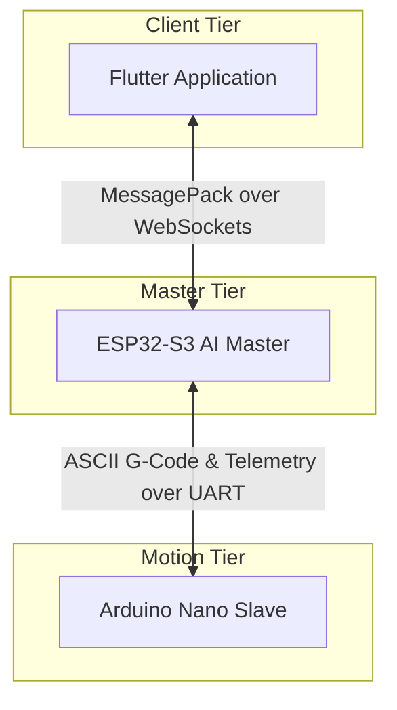
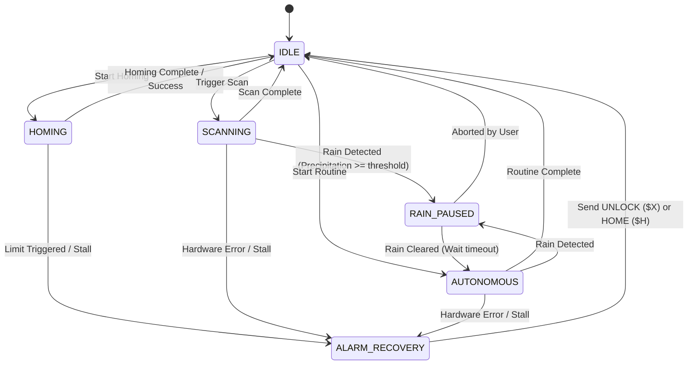

# Agri3D System Master Plan & Architecture Guide

Welcome to the **Agri3D Cartesian Gantry System (Mark 2)** master plan repository. This directory serves as the documentation and design hub for the entire project.

---

## 1. System Topology

The system is split into three decoupled tiers:



---

## 2. Project Directory Structure

```text
AGRI_3D-App_Mark2/
├── masterplan/                 # High-level architecture, design specifications, and guides
│   └── README.md               # This file
│
├── communication/              # MessagePack contract schema and compilation tools
│   ├── protocol_schema.json    # The human-readable communication schema definition
│   └── sync_contracts.py       # Code generator script for C++ and Dart models
│
├── AI-Agri3D/                  # ESP32-S3 Master controller firmware (FreeRTOS)
│
├── GRBL-AGRI3D/                # Arduino Nano motion controller firmware (GRBL Fork)
│
└── agri3d_flutter/             # Cross-platform Flutter user interface application
```

---

## 3. State-Centric Architecture & Safety Rules

Both the Master (ESP32-S3) and the Slave (Arduino Nano) are designed as **State-Centric State Machines** to ensure safety, predictable behavior, and clean recovery paths.

### A. Arduino Nano (Motion Engine) States
The Nano operates standard GRBL states (`IDLE`, `RUN`, `HOLD`, `JOG`, `HOME`, `ALARM`).
*   **State Safety Rule**: Relays and tools (water pump, fertilizer pump, sensor actuator) can **only** be triggered if the motion state is `IDLE` or `HOLD`.
*   **Emergency Stop / StallGuard Alarm**: If an axis stalls or limits are reached, the Nano instantly transitions to `ALARM` state, overrides any active motion, shuts off all relays immediately, and alerts the ESP32.

### B. ESP32-S3 (Orchestration Engine) States
The ESP32 coordinates the high-level `OperationState` and integrates environmental inputs (`EnvironmentState`) with hardware feedback.



### C. Master Safety Rules
1.  **Rain Gating**: If the analog rain sensor transitions to `RAIN_SENSOR` or the weather API registers local precipitation, the ESP32 immediately commands a `Feed Hold` to the Nano, raises the NPK sensor probe, and enters the `RAIN_PAUSED` state.
2.  **Watchdog Check**: The ESP32 polls the Nano every 50ms (in motion) or 250ms (idle). If the Nano stops responding for more than 4 poll cycles, the ESP32 enters `ALARM_RECOVERY`, stops any automated task, and alerts the Flutter client.
3.  **Client Disconnection**: If the WebSocket link to the Flutter app breaks, the ESP32 enters a safe mode, disabling the live camera stream and pausing any non-autonomous tasks.

---

## 4. Communication Architecture Guidelines

### A. ESP32-S3 ↔ Flutter (WebSockets)
*   **Protocol**: MessagePack binary framing.
*   **Schema Enforcement**: Managed strictly by `communication/protocol_schema.json`.
*   **Debugging**: Enabled via compile-time preprocessor flags on the ESP32 to dump binary payloads as formatted JSON to the serial console.

### B. ESP32-S3 ↔ Arduino Nano (UART Serial)
*   **Protocol**: Standard ASCII G-code commands and responses.
*   **Telemetries**: Customized status payloads (e.g. including `TMC` status and `relay` states).
*   **Baud Rate**: 115200 Baud.

