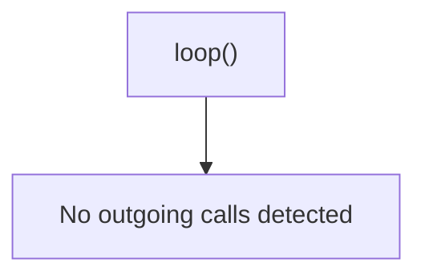
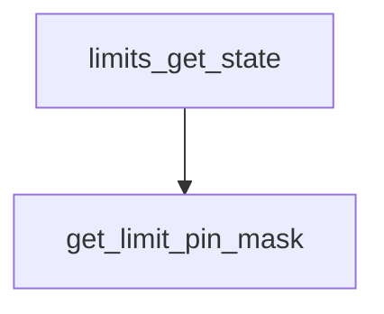

# Agri3D Codebase Knowledge Graph Report

This report lists files, function declarations, call flows, and potential clean-up candidates.

## 📊 Core Statistics

- **Total Files**: 44
- **Total Functions**: 155
- **Total Lines of Code**: 9092 LOC

## 📁 File Structure Index

| File Name | Path | Size (KB) | Lines | Includes |
| --- | --- | --- | --- | --- |
| `config.h` | `reference/config.h` | 3.21 KB | 99 | grbl-agri3d.h |
| `cpu_map.h` | `reference/cpu_map.h` | 2.69 KB | 77 | *None* |
| `defaults.h` | `reference/defaults.h` | 2.04 KB | 45 | *None* |
| `eeprom.c` | `reference/eeprom.c` | 4.85 KB | 138 | avr/interrupt.h, avr/io.h |
| `eeprom.h` | `reference/eeprom.h` | 0.65 KB | 19 | *None* |
| `TMC2209_17HS8401_Test.ino` | `reference/examples/TMC2209_17HS8401_Test/TMC2209_17HS8401_Test.ino` | 3.29 KB | 110 | Arduino.h, grbl-agri3d.h, tmc2209.h, tmc_uart.h, tmc_config.h |
| `grblUpload.ino` | `reference/examples/grblUpload/grblUpload.ino` | 0.23 KB | 12 | grbl-agri3d.h |
| `testgrbl.ino` | `reference/examples/testgrbl/testgrbl.ino` | 2.33 KB | 57 | grbl-agri3d.h |
| `tmc2209_simulator.ino` | `reference/examples/tmc2209_simulator/tmc2209_simulator.ino` | 8.47 KB | 239 | SoftwareSerial.h |
| `gcode.c` | `reference/gcode.c` | 33.93 KB | 903 | grbl-agri3d.h |
| `gcode.h` | `reference/gcode.h` | 6.6 KB | 177 | *None* |
| `grbl-agri3d.h` | `reference/grbl-agri3d.h` | 2.92 KB | 102 | avr/interrupt.h, avr/io.h, avr/pgmspace.h, avr/wdt.h, inttypes.h, math.h, stdbool.h, stdint.h, stdlib.h, string.h, util/delay.h, config.h, nuts_bolts.h, settings.h, system.h, defaults.h, cpu_map.h, planner.h, relays.h, eeprom.h, gcode.h, limits.h, motion_control.h, print.h, protocol.h, report.h, serial.h, tmc_uart.h, tmc_config.h, stepper.h, jog.h |
| `jog.c` | `reference/jog.c` | 1.76 KB | 54 | grbl-agri3d.h |
| `jog.h` | `reference/jog.h` | 1.0 KB | 34 | gcode.h |
| `limits.c` | `reference/limits.c` | 21.94 KB | 600 | grbl-agri3d.h, avr/wdt.h |
| `limits.h` | `reference/limits.h` | 0.55 KB | 25 | *None* |
| `main.c` | `reference/main.c` | 4.46 KB | 116 | grbl-agri3d.h, avr/wdt.h |
| `motion_control.c` | `reference/motion_control.c` | 10.76 KB | 273 | grbl-agri3d.h, tmc_config.h, util/delay.h |
| `motion_control.h` | `reference/motion_control.h` | 2.03 KB | 61 | *None* |
| `nuts_bolts.c` | `reference/nuts_bolts.c` | 5.39 KB | 194 | grbl-agri3d.h |
| `nuts_bolts.h` | `reference/nuts_bolts.h` | 3.02 KB | 93 | *None* |
| `planner.c` | `reference/planner.c` | 25.04 KB | 563 | grbl-agri3d.h |
| `planner.h` | `reference/planner.h` | 7.44 KB | 175 | *None* |
| `print.c` | `reference/print.c` | 2.59 KB | 130 | grbl-agri3d.h |
| `print.h` | `reference/print.h` | 0.88 KB | 26 | *None* |
| `protocol.c` | `reference/protocol.c` | 30.51 KB | 733 | grbl-agri3d.h, tmc_config.h, avr/wdt.h |
| `protocol.h` | `reference/protocol.h` | 1.84 KB | 51 | *None* |
| `relays.c` | `reference/relays.c` | 1.38 KB | 48 | grbl-agri3d.h |
| `relays.h` | `reference/relays.h` | 0.39 KB | 20 | grbl-agri3d.h |
| `report.c` | `reference/report.c` | 11.21 KB | 360 | grbl-agri3d.h, tmc_config.h, eeprom.h |
| `report.h` | `reference/report.h` | 3.63 KB | 111 | *None* |
| `serial.c` | `reference/serial.c` | 4.4 KB | 167 | grbl-agri3d.h |
| `serial.h` | `reference/serial.h` | 1.06 KB | 38 | stdint.h |
| `settings.c` | `reference/settings.c` | 13.43 KB | 400 | grbl-agri3d.h |
| `settings.h` | `reference/settings.h` | 6.07 KB | 161 | grbl-agri3d.h |
| `stepper.c` | `reference/stepper.c` | 49.11 KB | 1126 | grbl-agri3d.h, tmc_config.h |
| `stepper.h` | `reference/stepper.h` | 0.95 KB | 42 | *None* |
| `system.c` | `reference/system.c` | 16.09 KB | 478 | grbl-agri3d.h, tmc_config.h, tmc2209.h, tmc_uart.h |
| `system.h` | `reference/system.h` | 9.29 KB | 210 | grbl-agri3d.h |
| `tmc2209.h` | `reference/tmc2209.h` | 1.41 KB | 47 | stdbool.h, stdint.h |
| `tmc_config.c` | `reference/tmc_config.c` | 15.22 KB | 408 | tmc_config.h, grbl-agri3d.h, eeprom.h, tmc2209.h, tmc_uart.h, avr/io.h, util/delay.h, settings.h |
| `tmc_config.h` | `reference/tmc_config.h` | 3.42 KB | 82 | stdbool.h, stdint.h |
| `tmc_uart.c` | `reference/tmc_uart.c` | 6.63 KB | 240 | tmc_uart.h, tmc2209.h, avr/interrupt.h, avr/io.h, util/delay.h |
| `tmc_uart.h` | `reference/tmc_uart.h` | 1.48 KB | 48 | avr/io.h, stdbool.h, stdint.h |

## 🕸️ File Dependency Graph

```mermaid
graph TD
    config_h["config.h"]
    cpu_map_h["cpu_map.h"]
    defaults_h["defaults.h"]
    eeprom_c["eeprom.c"]
    eeprom_h["eeprom.h"]
    gcode_c["gcode.c"]
    gcode_h["gcode.h"]
    grbl_agri3d_h["grbl-agri3d.h"]
    jog_c["jog.c"]
    jog_h["jog.h"]
    limits_c["limits.c"]
    limits_h["limits.h"]
    main_c["main.c"]
    motion_control_c["motion_control.c"]
    motion_control_h["motion_control.h"]
    nuts_bolts_c["nuts_bolts.c"]
    nuts_bolts_h["nuts_bolts.h"]
    planner_c["planner.c"]
    planner_h["planner.h"]
    print_c["print.c"]
    print_h["print.h"]
    protocol_c["protocol.c"]
    protocol_h["protocol.h"]
    relays_c["relays.c"]
    relays_h["relays.h"]
    report_c["report.c"]
    report_h["report.h"]
    serial_c["serial.c"]
    serial_h["serial.h"]
    settings_c["settings.c"]
    settings_h["settings.h"]
    stepper_c["stepper.c"]
    stepper_h["stepper.h"]
    system_c["system.c"]
    system_h["system.h"]
    tmc2209_h["tmc2209.h"]
    tmc_config_c["tmc_config.c"]
    tmc_config_h["tmc_config.h"]
    tmc_uart_c["tmc_uart.c"]
    tmc_uart_h["tmc_uart.h"]
    grblUpload_ino["grblUpload.ino"]
    testgrbl_ino["testgrbl.ino"]
    TMC2209_17HS8401_Test_ino["TMC2209_17HS8401_Test.ino"]
    tmc2209_simulator_ino["tmc2209_simulator.ino"]
    config_h --> grbl_agri3d_h
    gcode_c --> grbl_agri3d_h
    grbl_agri3d_h --> config_h
    grbl_agri3d_h --> nuts_bolts_h
    grbl_agri3d_h --> settings_h
    grbl_agri3d_h --> system_h
    grbl_agri3d_h --> defaults_h
    grbl_agri3d_h --> cpu_map_h
    grbl_agri3d_h --> planner_h
    grbl_agri3d_h --> relays_h
    grbl_agri3d_h --> eeprom_h
    grbl_agri3d_h --> gcode_h
    grbl_agri3d_h --> limits_h
    grbl_agri3d_h --> motion_control_h
    grbl_agri3d_h --> print_h
    grbl_agri3d_h --> protocol_h
    grbl_agri3d_h --> report_h
    grbl_agri3d_h --> serial_h
    grbl_agri3d_h --> tmc_uart_h
    grbl_agri3d_h --> tmc_config_h
    grbl_agri3d_h --> stepper_h
    grbl_agri3d_h --> jog_h
    jog_c --> grbl_agri3d_h
    jog_h --> gcode_h
    limits_c --> grbl_agri3d_h
    main_c --> grbl_agri3d_h
    motion_control_c --> grbl_agri3d_h
    motion_control_c --> tmc_config_h
    nuts_bolts_c --> grbl_agri3d_h
    planner_c --> grbl_agri3d_h
    print_c --> grbl_agri3d_h
    protocol_c --> grbl_agri3d_h
    protocol_c --> tmc_config_h
    relays_c --> grbl_agri3d_h
    relays_h --> grbl_agri3d_h
    report_c --> grbl_agri3d_h
    report_c --> tmc_config_h
    report_c --> eeprom_h
    serial_c --> grbl_agri3d_h
    settings_c --> grbl_agri3d_h
    settings_h --> grbl_agri3d_h
    stepper_c --> grbl_agri3d_h
    stepper_c --> tmc_config_h
    system_c --> grbl_agri3d_h
    system_c --> tmc_config_h
    system_c --> tmc2209_h
    system_c --> tmc_uart_h
    system_h --> grbl_agri3d_h
    tmc_config_c --> tmc_config_h
    tmc_config_c --> grbl_agri3d_h
    tmc_config_c --> eeprom_h
    tmc_config_c --> tmc2209_h
    tmc_config_c --> tmc_uart_h
    tmc_config_c --> settings_h
    tmc_uart_c --> tmc_uart_h
    tmc_uart_c --> tmc2209_h
    grblUpload_ino --> grbl_agri3d_h
    testgrbl_ino --> grbl_agri3d_h
    TMC2209_17HS8401_Test_ino --> grbl_agri3d_h
    TMC2209_17HS8401_Test_ino --> tmc2209_h
    TMC2209_17HS8401_Test_ino --> tmc_uart_h
    TMC2209_17HS8401_Test_ino --> tmc_config_h
```

## 🔄 Key Entry Call Flows

### Call Flow from `main()`

```mermaid
graph TD
    gc_execute_line --> jog_execute
    gc_execute_line --> mc_dwell
    gc_execute_line --> mc_line
    gc_execute_line --> mc_override_ctrl_update
    gc_execute_line --> protocol_buffer_synchronize
    gc_execute_line --> protocol_execute_realtime
    gc_execute_line --> read_float
    gc_execute_line --> relay_fert
    gc_execute_line --> relay_water
    gc_execute_line --> relay_weeder
    gc_execute_line --> report_feedback_message
    gc_execute_line --> settings_read_coord_data
    gc_execute_line --> settings_write_coord_data
    gc_execute_line --> system_flag_wco_change
    gc_execute_line --> system_set_exec_state_flag
    gc_sync_position --> system_convert_array_steps_to_mpos
    limits_get_state --> get_limit_pin_mask
    limits_init --> limits_disable
    main --> gc_init
    main --> gc_sync_position
    main --> limits_init
    main --> plan_reset
    main --> plan_sync_position
    main --> protocol_main_loop
    main --> relays_init
    main --> report_init_message
    main --> serial_init
    main --> serial_reset_read_buffer
    main --> settings_init
    main --> st_reset
    main --> stepper_init
    main --> tmc_config_init_all
    main --> tmc_uart_init
    plan_reset --> plan_reset_buffer
    printPgmString --> serial_write
    printString --> serial_write
    print_uint8_base10 --> serial_write
    protocol_auto_cycle_start --> system_set_exec_state_flag
    protocol_execute_realtime --> protocol_exec_rt_suspend
    protocol_execute_realtime --> protocol_exec_rt_system
    protocol_main_loop --> gc_execute_line
    protocol_main_loop --> limits_get_state
    protocol_main_loop --> protocol_auto_cycle_start
    protocol_main_loop --> protocol_execute_realtime
    protocol_main_loop --> report_echo_line_received
    protocol_main_loop --> report_feedback_message
    protocol_main_loop --> report_status_message
    protocol_main_loop --> serial_read
    protocol_main_loop --> system_execute_line
    protocol_main_loop --> system_execute_startup
    protocol_main_loop --> tmc_config_poll_state
    read_global_settings --> eeprom_get_char
    read_global_settings --> memcpy_from_eeprom_with_checksum
    report_echo_line_received --> printPgmString
    report_echo_line_received --> printString
    report_echo_line_received --> report_util_feedback_line_feed
    report_feedback_message --> printPgmString
    report_feedback_message --> report_util_feedback_line_feed
    report_grbl_settings --> report_util_float_setting
    report_grbl_settings --> report_util_uint8_setting
    report_init_message --> eeprom_get_char
    report_init_message --> printPgmString
    report_init_message --> printString
    report_init_message --> print_uint8_base10
    report_init_message --> serial_write
    report_status_message --> printPgmString
    report_status_message --> print_uint8_base10
    report_status_message --> report_util_line_feed
    settings_init --> read_global_settings
    settings_init --> report_grbl_settings
    settings_init --> report_status_message
    settings_init --> settings_restore
    settings_restore --> eeprom_put_char
    settings_restore --> settings_write_coord_data
    settings_restore --> write_global_settings
    st_generate_step_dir_invert_masks --> get_direction_pin_mask
    st_generate_step_dir_invert_masks --> get_step_pin_mask
    st_go_idle --> delay_ms
    st_go_idle --> tmc_disable_steppers
    st_go_idle --> tmc_enable_steppers
    st_reset --> st_generate_step_dir_invert_masks
    st_reset --> st_go_idle
    system_convert_array_steps_to_mpos --> system_convert_axis_steps_to_mpos
    system_execute_line --> delay_ms
    system_execute_line --> eeprom_put_char
    system_execute_line --> gc_execute_line
    system_execute_line --> mc_homing_cycle
    system_execute_line --> mc_reset
    system_execute_line --> printPgmString
    system_execute_line --> printString
    system_execute_line --> print_uint32_base10
    system_execute_line --> read_float
    system_execute_line --> report_build_info
    system_execute_line --> report_feedback_message
    system_execute_line --> report_gcode_modes
    system_execute_line --> report_grbl_help
    system_execute_line --> report_grbl_settings
    system_execute_line --> report_startup_line
    system_execute_line --> report_status_message
    system_execute_line --> serial_read
    system_execute_line --> serial_write
    system_execute_line --> settings_read_build_info
    system_execute_line --> settings_read_startup_line
    system_execute_line --> settings_restore
    system_execute_line --> settings_store_build_info
    system_execute_line --> settings_store_global_setting
    system_execute_line --> settings_store_startup_line
    system_execute_line --> st_go_idle
    system_execute_line --> system_execute_startup
    system_execute_line --> system_set_exec_state_flag
    system_execute_line --> tmc_crc8
    system_execute_line --> tmc_report_details
    system_execute_line --> tmc_uart_read_raw
    system_execute_line --> tmc_uart_read_reg_async
    system_execute_startup --> gc_execute_line
    system_execute_startup --> report_execute_startup_message
    system_execute_startup --> settings_read_startup_line
    tmc_config_init_all --> tmc_stallguard_disable
    tmc_config_init_all --> tmc_uart_write_reg
    tmc_config_poll_state --> eeprom_get_char
    tmc_config_poll_state --> eeprom_put_char
    tmc_config_poll_state --> printPgmString
    tmc_config_poll_state --> printString
    tmc_config_poll_state --> print_uint8_base10
    tmc_config_poll_state --> serial_write
    tmc_config_poll_state --> tmc_uart_read_reg_async
    tmc_stallguard_disable --> tmc_uart_write_reg
    tmc_uart_write_reg --> tmc_crc8
    tmc_uart_write_reg --> tmc_uart_tx_byte
```

### Call Flow from `loop()`

### Call Flow from `mc_line()`

```mermaid
graph TD
    limits_soft_check --> mc_reset
    limits_soft_check --> protocol_execute_realtime
    limits_soft_check --> system_check_travel_limits
    limits_soft_check --> system_set_exec_alarm
    limits_soft_check --> system_set_exec_state_flag
    mc_line --> limits_soft_check
    mc_line --> mc_reset
    mc_line --> plan_buffer_line
    mc_line --> plan_check_full_buffer
    mc_line --> printPgmString
    mc_line --> protocol_auto_cycle_start
    mc_line --> protocol_execute_realtime
    mc_line --> system_set_exec_alarm
    mc_reset --> relays_stop_all
    mc_reset --> st_go_idle
    mc_reset --> system_set_exec_alarm
    mc_reset --> system_set_exec_state_flag
    plan_buffer_line --> convert_delta_vector_to_unit_vector
    plan_buffer_line --> get_direction_pin_mask
    plan_buffer_line --> limit_value_by_axis_maximum
    plan_buffer_line --> plan_compute_profile_nominal_speed
    plan_buffer_line --> plan_compute_profile_parameters
    plan_buffer_line --> plan_next_block_index
    plan_buffer_line --> planner_recalculate
    planner_recalculate --> plan_next_block_index
    planner_recalculate --> plan_prev_block_index
    planner_recalculate --> st_update_plan_block_parameters
    printPgmString --> serial_write
    protocol_auto_cycle_start --> system_set_exec_state_flag
    protocol_exec_rt_system --> gc_sync_position
    protocol_exec_rt_system --> plan_cycle_reinitialize
    protocol_exec_rt_system --> plan_reset
    protocol_exec_rt_system --> plan_sync_position
    protocol_exec_rt_system --> plan_update_velocity_profile_parameters
    protocol_exec_rt_system --> report_alarm_message
    protocol_exec_rt_system --> report_feedback_message
    protocol_exec_rt_system --> report_realtime_status
    protocol_exec_rt_system --> st_prep_buffer
    protocol_exec_rt_system --> st_reset
    protocol_exec_rt_system --> st_update_plan_block_parameters
    protocol_exec_rt_system --> st_wake_up
    protocol_exec_rt_system --> system_clear_exec_alarm
    protocol_exec_rt_system --> system_clear_exec_motion_overrides
    protocol_exec_rt_system --> system_clear_exec_state_flag
    protocol_execute_realtime --> protocol_exec_rt_suspend
    protocol_execute_realtime --> protocol_exec_rt_system
    st_go_idle --> delay_ms
    st_go_idle --> tmc_disable_steppers
    st_go_idle --> tmc_enable_steppers
```

### Call Flow from `limits_get_state()`

## 🧼 Clean-up Candidates (door, spindle, coolant, parking)

These locations contain code references to legacy CNC systems (like spindle, coolant, safety door, etc.) which should be removed or cleaned up in our restarted clean code:

### 📍 `reference/config.h`

| Line | Term | Match Snippet |
| --- | --- | --- |
| 3 | **spindle** | `All legacy CNC bloat (Laser, Spindle, Coolant, Overrides) purged.` |
| 3 | **coolant** | `All legacy CNC bloat (Laser, Spindle, Coolant, Overrides) purged.` |
| 29 | **spindle** | `// Core Feed & Rapid Overrides (Spindle/Coolant Overrides Purged)` |
| 29 | **coolant** | `// Core Feed & Rapid Overrides (Spindle/Coolant Overrides Purged)` |

### 📍 `reference/gcode.c`

| Line | Term | Match Snippet |
| --- | --- | --- |
| 251 | **parking** | `#ifdef ENABLE_PARKING_OVERRIDE_CONTROL` |
| 254 | **parking** | `gc_block.modal.override = OVERRIDE_PARKING_MOTION;` |
| 445 | **spindle** | `// [4. Set spindle speed ]: N/A` |
| 448 | **spindle** | `// [7. Spindle control ]: N/A` |
| 449 | **coolant** | `// [8. Coolant control ]: N/A` |
| 450 | **parking** | `// [9. Override control ]: Not supported except for a Grbl-only parking motion` |
| 452 | **parking** | `#ifdef ENABLE_PARKING_OVERRIDE_CONTROL` |
| 713 | **spindle** | `// [4-6. Spindle / Tool ]: N/A` |
| 743 | **parking** | `// [9. Override control ]: Not supported except for a Grbl-only parking control.` |
| 744 | **parking** | `#ifdef ENABLE_PARKING_OVERRIDE_CONTROL` |
| 847 | **parking** | `#ifdef ENABLE_PARKING_OVERRIDE_CONTROL` |
| 848 | **parking** | `#ifdef DEACTIVATE_PARKING_UPON_INIT` |
| 851 | **parking** | `gc_state.modal.override = OVERRIDE_PARKING_MOTION;` |
| 860 | **spindle** | `// Execute coordinate change and spindle/coolant stop.` |
| 860 | **coolant** | `// Execute coordinate change and spindle/coolant stop.` |
| 898 | **coolant** | `group 8 = {M7*} enable mist coolant (* Compile-option)` |

### 📍 `reference/gcode.h`

| Line | Term | Match Snippet |
| --- | --- | --- |
| 96 | **parking** | `#ifdef DEACTIVATE_PARKING_UPON_INIT` |

### 📍 `reference/grbl-agri3d.h`

| Line | Term | Match Snippet |
| --- | --- | --- |
| 73 | **parking** | `#if defined(PARKING_ENABLE)` |
| 76 | **parking** | `"HOMING_FORCE_SET_ORIGIN is not supported with PARKING_ENABLE at this time."` |
| 80 | **parking** | `#if defined(ENABLE_PARKING_OVERRIDE_CONTROL)` |
| 81 | **parking** | `#if !defined(PARKING_ENABLE)` |
| 82 | **parking** | `#error "ENABLE_PARKING_OVERRIDE_CONTROL must be enabled with PARKING_ENABLE."` |

### 📍 `reference/jog.c`

| Line | Term | Match Snippet |
| --- | --- | --- |
| 27 | **spindle** | `// NOTE: Spindle and coolant are allowed to fully function with overrides` |
| 27 | **coolant** | `// NOTE: Spindle and coolant are allowed to fully function with overrides` |

### 📍 `reference/limits.c`

| Line | Term | Match Snippet |
| --- | --- | --- |
| 233 | **door** | `(EXEC_SAFETY_DOOR \| EXEC_RESET \| EXEC_CYCLE_STOP)) {` |
| 239 | **door** | `// Homing failure condition: Safety door was opened.` |
| 240 | **door** | `if (rt_exec & EXEC_SAFETY_DOOR) {` |
| 241 | **door** | `system_set_exec_alarm(EXEC_ALARM_HOMING_FAIL_DOOR);` |
| 374 | **door** | `(EXEC_SAFETY_DOOR \| EXEC_RESET \| EXEC_CYCLE_STOP)) {` |
| 591 | **spindle** | `mc_reset(); // Issue system reset and ensure spindle and coolant are` |
| 591 | **coolant** | `mc_reset(); // Issue system reset and ensure spindle and coolant are` |

### 📍 `reference/main.c`

| Line | Term | Match Snippet |
| --- | --- | --- |
| 36 | **spindle** | `// Probes, Spindle overrides explicitly removed for Agri3D.` |
| 97 | **spindle** | `// Spindle/Coolant logic removed -> initializing native Agri3D relays` |
| 97 | **coolant** | `// Spindle/Coolant logic removed -> initializing native Agri3D relays` |

### 📍 `reference/motion_control.c`

| Line | Term | Match Snippet |
| --- | --- | --- |
| 127 | **spindle** | `mc_reset(); // Issue system reset and ensure spindle and coolant are` |
| 127 | **coolant** | `mc_reset(); // Issue system reset and ensure spindle and coolant are` |
| 193 | **parking** | `// Plans and executes the single special motion case for parking. Independent of` |
| 196 | **parking** | `#ifdef PARKING_ENABLE` |
| 197 | **parking** | `void mc_parking_motion(float *parking_target, plan_line_data_t *pl_data) {` |
| 202 | **parking** | `uint8_t plan_status = plan_buffer_line(parking_target, pl_data);` |
| 207 | **parking** | `STEP_CONTROL_END_MOTION); // Allow parking motion to execute, if` |
| 209 | **parking** | `st_parking_setup_buffer(); // Setup step segment buffer for special parking` |
| 219 | **parking** | `st_parking_restore_buffer(); // Restore step segment buffer to normal run` |
| 228 | **parking** | `#ifdef ENABLE_PARKING_OVERRIDE_CONTROL` |

### 📍 `reference/motion_control.h`

| Line | Term | Match Snippet |
| --- | --- | --- |
| 52 | **parking** | `// Plans and executes the single special motion case for parking. Independent of` |
| 54 | **parking** | `void mc_parking_motion(float *parking_target, plan_line_data_t *pl_data);` |

### 📍 `reference/nuts_bolts.c`

| Line | Term | Match Snippet |
| --- | --- | --- |
| 129 | **door** | `} // Bail, if safety door reopens.` |

### 📍 `reference/planner.c`

| Line | Term | Match Snippet |
| --- | --- | --- |
| 293 | **parking** | `// override values. NOTE: All system motion commands, such as homing/parking,` |

### 📍 `reference/planner.h`

| Line | Term | Match Snippet |
| --- | --- | --- |
| 55 | **spindle** | `(PL_COND_FLAG_SPINDLE_CW \| PL_COND_FLAG_SPINDLE_CCW)` |
| 57 | **spindle** | `(PL_COND_FLAG_SPINDLE_CW \| PL_COND_FLAG_SPINDLE_CCW \|                        \` |
| 58 | **coolant** | `PL_COND_FLAG_COOLANT_FLOOD \| PL_COND_FLAG_COOLANT_MIST)` |
| 103 | **spindle** | `#ifdef VARIABLE_SPINDLE` |
| 104 | **spindle** | `// Stored spindle speed data used by spindle overrides` |
| 106 | **spindle** | `float spindle_speed; // Block spindle speed. Copied from pl_line_data.` |
| 114 | **spindle** | `float spindle_speed; // Desired spindle speed through line motion.` |
| 136 | **parking** | `// Gets the planner block for the special system motion cases. (Parking/Homing)` |

### 📍 `reference/protocol.c`

| Line | Term | Match Snippet |
| --- | --- | --- |
| 57 | **door** | `// All systems go! (Safety door check removed for Agri3D)` |
| 277 | **door** | `(EXEC_MOTION_CANCEL \| EXEC_FEED_HOLD \| EXEC_SAFETY_DOOR \| EXEC_SLEEP)) {` |
| 312 | **door** | `// SAFETY_DOOR may been initiated beforehand to hold the CYCLE. Motion` |
| 323 | **door** | `// Block SAFETY_DOOR, JOG, and SLEEP states from changing to HOLD` |
| 325 | **door** | `if (!(sys.state & (STATE_SAFETY_DOOR \| STATE_JOG \| STATE_SLEEP))) {` |
| 330 | **door** | `// Execute a safety door stop with a feed hold and disable` |
| 331 | **door** | `// spindle/coolant. NOTE: Safety door differs from feed holds by` |
| 331 | **spindle** | `// spindle/coolant. NOTE: Safety door differs from feed holds by` |
| 331 | **coolant** | `// spindle/coolant. NOTE: Safety door differs from feed holds by` |
| 333 | **spindle** | `// (spindle/coolant), and blocks resuming until switch is re-engaged.` |
| 333 | **coolant** | `// (spindle/coolant), and blocks resuming until switch is re-engaged.` |
| 334 | **door** | `if (rt_exec & EXEC_SAFETY_DOOR) {` |
| 335 | **door** | `report_feedback_message(MESSAGE_SAFETY_DOOR_AJAR);` |
| 336 | **door** | `// If jogging, block safety door methods until jog cancel is complete.` |
| 339 | **parking** | `// Check if the safety re-opened during a restore parking motion` |
| 341 | **door** | `if (sys.state == STATE_SAFETY_DOOR) {` |
| 344 | **parking** | `#ifdef PARKING_ENABLE` |
| 346 | **parking** | `// parking sequence.` |
| 363 | **door** | `sys.state = STATE_SAFETY_DOOR;` |
| 366 | **door** | `// NOTE: This flag doesn't change when the door closes, unlike` |
| 367 | **door** | `// sys.state. Ensures any parking motions are executed if the door` |
| 367 | **parking** | `// sys.state. Ensures any parking motions are executed if the door` |
| 369 | **door** | `sys.suspend \|= SUSPEND_SAFETY_DOOR_AJAR;` |
| 381 | **door** | `EXEC_SAFETY_DOOR \| EXEC_SLEEP));` |
| 388 | **door** | `// cancel, and safety door. Ensures auto-cycle-start doesn't resume a hold` |
| 391 | **door** | `(EXEC_FEED_HOLD \| EXEC_MOTION_CANCEL \| EXEC_SAFETY_DOOR))) {` |
| 392 | **door** | `// Resume door state when parking motion has retracted and door has been` |
| 392 | **parking** | `// Resume door state when parking motion has retracted and door has been` |
| 394 | **door** | `if ((sys.state == STATE_SAFETY_DOOR) &&` |
| 395 | **door** | `!(sys.suspend & SUSPEND_SAFETY_DOOR_AJAR)) {` |
| 401 | **door** | `// position, if disabled by SAFETY_DOOR. NOTE: For a safety door to` |
| 444 | **door** | `if ((sys.state & (STATE_HOLD \| STATE_SAFETY_DOOR \| STATE_SLEEP)) &&` |
| 447 | **door** | `// DOOR states until user has issued a resume command or reset.` |
| 466 | **door** | `if (sys.suspend & SUSPEND_SAFETY_DOOR_AJAR) { // Only occurs when safety` |
| 467 | **door** | `// door opens during jog.` |
| 470 | **door** | `sys.state = STATE_SAFETY_DOOR;` |
| 534 | **door** | `if (sys.state & (STATE_CYCLE \| STATE_HOLD \| STATE_SAFETY_DOOR \| STATE_HOMING \|` |
| 540 | **door** | `// Handles Grbl system suspend procedures, such as feed hold, safety door, and` |
| 541 | **parking** | `// parking motion. The system will enter this loop, create local variables for` |
| 544 | **parking** | `// promote custom parking motions. Simply use this as a template` |
| 546 | **parking** | `#ifdef PARKING_ENABLE` |
| 547 | **parking** | `// Declare and initialize parking local variables` |
| 549 | **parking** | `float parking_target[N_AXIS];` |
| 550 | **parking** | `float retract_waypoint = PARKING_PULLOUT_INCREMENT;` |
| 557 | **parking** | `pl_data->line_number = PARKING_MOTION_LINE_NUMBER;` |
| 562 | **spindle** | `// Spindle + coolant variables completely stripped for Agri3D` |
| 562 | **coolant** | `// Spindle + coolant variables completely stripped for Agri3D` |
| 573 | **parking** | `// Parking manager. Handles de/re-energizing, switch state checks, and` |
| 574 | **door** | `// parking motions for the safety door and sleep states.` |
| 574 | **parking** | `// parking motions for the safety door and sleep states.` |
| 575 | **door** | `if (sys.state & (STATE_SAFETY_DOOR \| STATE_SLEEP)) {` |
| 580 | **spindle** | `// (spindle_stop_ovr removed: spindle not used in Agri3D)` |
| 588 | **spindle** | `// Get current position and store restore location and spindle retract` |
| 590 | **parking** | `system_convert_array_steps_to_mpos(parking_target, sys_position);` |
| 592 | **parking** | `memcpy(restore_target, parking_target, sizeof(parking_target));` |
| 593 | **parking** | `retract_waypoint += restore_target[PARKING_AXIS];` |
| 594 | **parking** | `retract_waypoint = min(retract_waypoint, PARKING_TARGET);` |
| 597 | **parking** | `// Execute slow pull-out parking retract motion. Parking requires homing` |
| 598 | **parking** | `// enabled, the current location not exceeding the parking target location, and` |
| 599 | **door** | `// laser mode disabled. NOTE: State is will remain DOOR, until the de-energizing` |
| 601 | **parking** | `#ifdef ENABLE_PARKING_OVERRIDE_CONTROL` |
| 603 | **parking** | `(parking_target[PARKING_AXIS] < PARKING_TARGET) &&` |
| 605 | **parking** | `(sys.override_ctrl == OVERRIDE_PARKING_MOTION)) {` |
| 608 | **parking** | `(parking_target[PARKING_AXIS] < PARKING_TARGET) &&` |
| 611 | **spindle** | `// Retract spindle by pullout distance. Ensure retraction motion` |
| 613 | **parking** | `// the parking target location.` |
| 614 | **parking** | `if (parking_target[PARKING_AXIS] < retract_waypoint) {` |
| 615 | **parking** | `parking_target[PARKING_AXIS] = retract_waypoint;` |
| 616 | **parking** | `pl_data->feed_rate = PARKING_PULLOUT_RATE;` |
| 617 | **parking** | `mc_parking_motion(parking_target, pl_data);` |
| 626 | **parking** | `// Execute fast parking retract motion to parking target location.` |
| 627 | **parking** | `if (parking_target[PARKING_AXIS] < PARKING_TARGET) {` |
| 628 | **parking** | `parking_target[PARKING_AXIS] = PARKING_TARGET;` |
| 629 | **parking** | `pl_data->feed_rate = PARKING_RATE;` |
| 630 | **parking** | `mc_parking_motion(parking_target, pl_data);` |
| 635 | **parking** | `// Parking motion not possible. Just disable the relays.` |
| 658 | **door** | `// Allows resuming from parking/safety door. Actively checks if safety` |
| 658 | **parking** | `// Allows resuming from parking/safety door. Actively checks if safety` |
| 659 | **door** | `// door is closed and ready to resume. Safety door removed for Agri3D.` |
| 660 | **door** | `// Door is always considered closed.` |
| 661 | **door** | `sys.suspend &= ~(SUSPEND_SAFETY_DOOR_AJAR); // Always allow resume.` |
| 663 | **door** | `// Handles parking restore and safety door resume.` |
| 663 | **parking** | `// Handles parking restore and safety door resume.` |
| 666 | **parking** | `#ifdef PARKING_ENABLE` |
| 667 | **parking** | `// Execute fast restore motion to the pull-out position. Parking requires homing` |
| 668 | **door** | `// enabled. NOTE: State is will remain DOOR, until the de-energizing and retract` |
| 670 | **parking** | `#ifdef ENABLE_PARKING_OVERRIDE_CONTROL` |
| 674 | **parking** | `(sys.override_ctrl == OVERRIDE_PARKING_MOTION)) {` |
| 682 | **parking** | `if (parking_target[PARKING_AXIS] <= PARKING_TARGET) {` |
| 683 | **parking** | `parking_target[PARKING_AXIS] = retract_waypoint;` |
| 684 | **parking** | `pl_data->feed_rate = PARKING_RATE;` |
| 685 | **parking** | `mc_parking_motion(parking_target, pl_data);` |
| 693 | **parking** | `#ifdef PARKING_ENABLE` |
| 695 | **parking** | `#ifdef ENABLE_PARKING_OVERRIDE_CONTROL` |
| 699 | **parking** | `(sys.override_ctrl == OVERRIDE_PARKING_MOTION)) {` |
| 705 | **door** | `// Block if safety door re-opened during prior restore actions.` |
| 707 | **parking** | `// Regardless if the retract parking motion was a valid/safe` |
| 708 | **parking** | `// motion or not, the restore parking motion should logically be` |
| 711 | **parking** | `pl_data->feed_rate = PARKING_PULLOUT_RATE;` |
| 712 | **parking** | `mc_parking_motion(restore_target, pl_data);` |

### 📍 `reference/relays.c`

| Line | Term | Match Snippet |
| --- | --- | --- |
| 3 | **spindle** | `All legacy CNC Spindle/Coolant logic completely removed.` |
| 3 | **coolant** | `All legacy CNC Spindle/Coolant logic completely removed.` |

### 📍 `reference/relays.h`

| Line | Term | Match Snippet |
| --- | --- | --- |
| 3 | **spindle** | `All legacy CNC Spindle/Coolant logic completely removed.` |
| 3 | **coolant** | `All legacy CNC Spindle/Coolant logic completely removed.` |

### 📍 `reference/report.c`

| Line | Term | Match Snippet |
| --- | --- | --- |
| 6 | **spindle** | `coolants, PWM spindles, and inch-conversion have been stripped.` |
| 6 | **coolant** | `coolants, PWM spindles, and inch-conversion have been stripped.` |
| 86 | **door** | `case MESSAGE_SAFETY_DOOR_AJAR:` |
| 87 | **door** | `printPgmString(PSTR("Check Door"));` |
| 98 | **spindle** | `case MESSAGE_SPINDLE_RESTORE:` |
| 99 | **spindle** | `printPgmString(PSTR("Restoring spindle"));` |
| 184 | **spindle** | `// Settings $30, $31, $32 strictly removed (Spindle/Laser logic disabled for` |
| 324 | **door** | `case STATE_SAFETY_DOOR:` |
| 325 | **door** | `printPgmString(PSTR("Door"));` |

### 📍 `reference/serial.c`

| Line | Term | Match Snippet |
| --- | --- | --- |
| 130 | **door** | `case CMD_SAFETY_DOOR:` |
| 131 | **door** | `system_set_exec_state_flag(EXEC_SAFETY_DOOR);` |

### 📍 `reference/stepper.c`

| Line | Term | Match Snippet |
| --- | --- | --- |
| 157 | **parking** | `#ifdef PARKING_ENABLE` |
| 577 | **parking** | `#ifdef PARKING_ENABLE` |
| 579 | **parking** | `// parking motion.` |
| 580 | **parking** | `void st_parking_setup_buffer() {` |
| 588 | **parking** | `// Set flags to execute a parking motion` |
| 589 | **parking** | `prep.recalculate_flag \|= PREP_FLAG_PARKING;` |
| 591 | **parking** | `pl_block = NULL; // Always reset parking motion to reload new block.` |
| 594 | **parking** | `// Restores the step segment buffer to the normal run state after a parking` |
| 596 | **parking** | `void st_parking_restore_buffer() {` |
| 659 | **parking** | `#ifdef PARKING_ENABLE` |
| 660 | **parking** | `if (prep.recalculate_flag & PREP_FLAG_PARKING) {` |
| 1000 | **parking** | `#ifdef PARKING_ENABLE` |
| 1001 | **parking** | `if (!(prep.recalculate_flag & PREP_FLAG_PARKING)) {` |
| 1093 | **parking** | `#ifdef PARKING_ENABLE` |
| 1094 | **parking** | `if (!(prep.recalculate_flag & PREP_FLAG_PARKING)) {` |
| 1121 | **door** | `STATE_SAFETY_DOOR)) {` |

### 📍 `reference/system.c`

| Line | Term | Match Snippet |
| --- | --- | --- |
| 26 | **door** | `// system_init(), system_control_get_state(), system_check_safety_door_ajar()` |
| 217 | **door** | `// Block if safety door is ajar.` |
| 218 | **door** | `// Safety door removed for Agri3D (open field farming robot).` |
| 238 | **door** | `// Safety door removed for Agri3D.` |
| 476 | **spindle** | `// system_clear_exec_accessory_overrides() removed: spindle/coolant accessories` |
| 476 | **coolant** | `// system_clear_exec_accessory_overrides() removed: spindle/coolant accessories` |

### 📍 `reference/system.h`

| Line | Term | Match Snippet |
| --- | --- | --- |
| 53 | **spindle** | `// Override bit maps. Realtime bitflags to control feed, rapid, spindle, and` |
| 54 | **spindle** | `// coolant overrides. Spindle/coolant and feed/rapids are separated into two` |
| 54 | **coolant** | `// coolant overrides. Spindle/coolant and feed/rapids are separated into two` |
| 66 | **spindle** | `// EXEC_SPINDLE_OVR_* and EXEC_COOLANT_OVR_* removed: spindle/coolant stripped` |
| 66 | **coolant** | `// EXEC_SPINDLE_OVR_* and EXEC_COOLANT_OVR_* removed: spindle/coolant stripped` |
| 83 | **door** | `bit(6) // Safety door is ajar. Feed holds and de-energizes system.` |
| 91 | **parking** | `bit(1) // Flag to indicate a retract from a restore parking motion.` |
| 93 | **door** | `bit(2) // (Safety door only) Indicates retraction and de-energizing is` |
| 96 | **door** | `bit(3) // (Safety door only) Flag to initiate resume procedures from a cycle` |
| 99 | **door** | `bit(4) // (Safety door only) Indicates ready to resume normal operation.` |
| 101 | **door** | `bit(5) // Tracks safety door state for resuming.` |
| 118 | **spindle** | `// SPINDLE_STOP_OVR_* defines removed: spindle not used in Agri3D.` |
| 125 | **door** | `// cancels, and safety door.` |
| 138 | **spindle** | `// spindle_speed_ovr, spindle_stop_ovr removed: spindle stripped.` |
| 143 | **parking** | `#ifdef ENABLE_PARKING_OVERRIDE_CONTROL` |
| 146 | **spindle** | `// VARIABLE_SPINDLE spindle_speed removed: spindle stripped.` |
| 169 | **spindle** | `// sys_rt_exec_accessory_override removed: spindle/coolant not used in Agri3D.` |
| 169 | **coolant** | `// sys_rt_exec_accessory_override removed: spindle/coolant not used in Agri3D.` |
| 177 | **door** | `// system_check_safety_door_ajar() removed. Agri3D has no physical control` |

