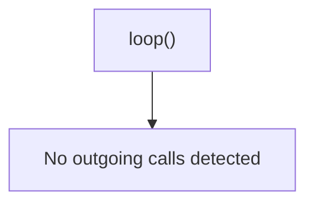
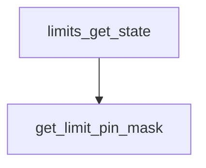

# Agri3D Codebase Knowledge Graph Report

This report lists files, function declarations, call flows, and potential clean-up candidates.

## 📊 Core Statistics

- **Total Files**: 41
- **Total Functions**: 150
- **Total Lines of Code**: 10532 LOC

## 📁 File Structure Index

| File Name | Path | Size (KB) | Lines | Includes |
| --- | --- | --- | --- | --- |
| `config.h` | `reference/config.h` | 48.5 KB | 693 | grbl.h |
| `coolant_control.c` | `reference/coolant_control.c` | 3.66 KB | 127 | grbl.h |
| `coolant_control.h` | `reference/coolant_control.h` | 1.47 KB | 48 | *None* |
| `cpu_map.h` | `reference/cpu_map.h` | 11.94 KB | 261 | *None* |
| `defaults.h` | `reference/defaults.h` | 28.43 KB | 572 | *None* |
| `eeprom.c` | `reference/eeprom.c` | 5.32 KB | 152 | avr/io.h, avr/interrupt.h |
| `eeprom.h` | `reference/eeprom.h` | 1.03 KB | 30 | *None* |
| `grblUpload.ino` | `reference/examples/grblUpload/grblUpload.ino` | 1.2 KB | 30 | grbl.h |
| `grblWrite_BuildInfo.ino` | `reference/examples/grblWrite_BuildInfo/grblWrite_BuildInfo.ino` | 3.58 KB | 110 | avr/pgmspace.h, EEPROM.h |
| `gcode.c` | `reference/gcode.c` | 61.18 KB | 1160 | grbl.h |
| `gcode.h` | `reference/gcode.h` | 10.18 KB | 249 | *None* |
| `grbl.h` | `reference/grbl.h` | 4.38 KB | 141 | avr/io.h, avr/pgmspace.h, avr/interrupt.h, avr/wdt.h, util/delay.h, math.h, inttypes.h, string.h, stdlib.h, stdint.h, stdbool.h, config.h, nuts_bolts.h, settings.h, system.h, defaults.h, cpu_map.h, planner.h, coolant_control.h, eeprom.h, gcode.h, limits.h, motion_control.h, planner.h, print.h, probe.h, protocol.h, report.h, serial.h, spindle_control.h, stepper.h, jog.h |
| `jog.c` | `reference/jog.c` | 1.73 KB | 51 | grbl.h |
| `jog.h` | `reference/jog.h` | 1.0 KB | 33 | gcode.h |
| `limits.c` | `reference/limits.c` | 18.25 KB | 431 | grbl.h |
| `limits.h` | `reference/limits.h` | 1.21 KB | 42 | *None* |
| `main.c` | `reference/main.c` | 4.43 KB | 110 | grbl.h |
| `motion_control.c` | `reference/motion_control.c` | 18.29 KB | 389 | grbl.h |
| `motion_control.h` | `reference/motion_control.h` | 2.61 KB | 67 | *None* |
| `nuts_bolts.c` | `reference/nuts_bolts.c` | 5.25 KB | 191 | grbl.h |
| `nuts_bolts.h` | `reference/nuts_bolts.h` | 3.0 KB | 88 | *None* |
| `planner.c` | `reference/planner.c` | 26.46 KB | 523 | grbl.h |
| `planner.h` | `reference/planner.h` | 6.81 KB | 151 | *None* |
| `print.c` | `reference/print.c` | 4.91 KB | 201 | grbl.h |
| `print.h` | `reference/print.h` | 1.63 KB | 52 | *None* |
| `probe.c` | `reference/probe.c` | 2.36 KB | 67 | grbl.h |
| `probe.h` | `reference/probe.h` | 1.57 KB | 44 | *None* |
| `protocol.c` | `reference/protocol.c` | 37.7 KB | 766 | grbl.h |
| `protocol.h` | `reference/protocol.h` | 1.84 KB | 50 | *None* |
| `report.c` | `reference/report.c` | 24.02 KB | 663 | grbl.h |
| `report.h` | `reference/report.h` | 4.37 KB | 132 | *None* |
| `serial.c` | `reference/serial.c` | 8.11 KB | 205 | grbl.h |
| `serial.h` | `reference/serial.h` | 1.84 KB | 63 | *None* |
| `settings.c` | `reference/settings.c` | 12.93 KB | 341 | grbl.h |
| `settings.h` | `reference/settings.h` | 5.74 KB | 154 | grbl.h |
| `spindle_control.c` | `reference/spindle_control.c` | 10.19 KB | 291 | grbl.h |
| `spindle_control.h` | `reference/spindle_control.h` | 2.51 KB | 74 | *None* |
| `stepper.c` | `reference/stepper.c` | 53.75 KB | 1096 | grbl.h |
| `stepper.h` | `reference/stepper.h` | 1.91 KB | 60 | *None* |
| `system.c` | `reference/system.c` | 15.54 KB | 411 | grbl.h |
| `system.h` | `reference/system.h` | 10.14 KB | 213 | grbl.h |

## 🕸️ File Dependency Graph

```mermaid
graph TD
    config_h["config.h"]
    coolant_control_c["coolant_control.c"]
    coolant_control_h["coolant_control.h"]
    cpu_map_h["cpu_map.h"]
    defaults_h["defaults.h"]
    eeprom_c["eeprom.c"]
    eeprom_h["eeprom.h"]
    gcode_c["gcode.c"]
    gcode_h["gcode.h"]
    grbl_h["grbl.h"]
    jog_c["jog.c"]
    jog_h["jog.h"]
    limits_c["limits.c"]
    limits_h["limits.h"]
    main_c["main.c"]
    motion_control_c["motion_control.c"]
    motion_control_h["motion_control.h"]
    nuts_bolts_c["nuts_bolts.c"]
    nuts_bolts_h["nuts_bolts.h"]
    planner_c["planner.c"]
    planner_h["planner.h"]
    print_c["print.c"]
    print_h["print.h"]
    probe_c["probe.c"]
    probe_h["probe.h"]
    protocol_c["protocol.c"]
    protocol_h["protocol.h"]
    report_c["report.c"]
    report_h["report.h"]
    serial_c["serial.c"]
    serial_h["serial.h"]
    settings_c["settings.c"]
    settings_h["settings.h"]
    spindle_control_c["spindle_control.c"]
    spindle_control_h["spindle_control.h"]
    stepper_c["stepper.c"]
    stepper_h["stepper.h"]
    system_c["system.c"]
    system_h["system.h"]
    grblUpload_ino["grblUpload.ino"]
    grblWrite_BuildInfo_ino["grblWrite_BuildInfo.ino"]
    config_h --> grbl_h
    coolant_control_c --> grbl_h
    gcode_c --> grbl_h
    grbl_h --> config_h
    grbl_h --> nuts_bolts_h
    grbl_h --> settings_h
    grbl_h --> system_h
    grbl_h --> defaults_h
    grbl_h --> cpu_map_h
    grbl_h --> planner_h
    grbl_h --> coolant_control_h
    grbl_h --> eeprom_h
    grbl_h --> gcode_h
    grbl_h --> limits_h
    grbl_h --> motion_control_h
    grbl_h --> planner_h
    grbl_h --> print_h
    grbl_h --> probe_h
    grbl_h --> protocol_h
    grbl_h --> report_h
    grbl_h --> serial_h
    grbl_h --> spindle_control_h
    grbl_h --> stepper_h
    grbl_h --> jog_h
    jog_c --> grbl_h
    jog_h --> gcode_h
    limits_c --> grbl_h
    main_c --> grbl_h
    motion_control_c --> grbl_h
    nuts_bolts_c --> grbl_h
    planner_c --> grbl_h
    print_c --> grbl_h
    probe_c --> grbl_h
    protocol_c --> grbl_h
    report_c --> grbl_h
    serial_c --> grbl_h
    settings_c --> grbl_h
    settings_h --> grbl_h
    spindle_control_c --> grbl_h
    stepper_c --> grbl_h
    system_c --> grbl_h
    system_h --> grbl_h
    grblUpload_ino --> grbl_h
```

## 🔄 Key Entry Call Flows

### Call Flow from `main()`

```mermaid
graph TD
    coolant_init --> coolant_stop
    gc_execute_line --> coolant_set_state
    gc_execute_line --> coolant_sync
    gc_execute_line --> gc_sync_position
    gc_execute_line --> hypot_f
    gc_execute_line --> jog_execute
    gc_execute_line --> mc_arc
    gc_execute_line --> mc_dwell
    gc_execute_line --> mc_line
    gc_execute_line --> mc_override_ctrl_update
    gc_execute_line --> mc_probe_cycle
    gc_execute_line --> protocol_buffer_synchronize
    gc_execute_line --> protocol_execute_realtime
    gc_execute_line --> read_float
    gc_execute_line --> report_feedback_message
    gc_execute_line --> settings_read_coord_data
    gc_execute_line --> settings_write_coord_data
    gc_execute_line --> spindle_sync
    gc_execute_line --> system_flag_wco_change
    gc_execute_line --> system_set_exec_state_flag
    gc_init --> report_status_message
    gc_init --> settings_read_coord_data
    gc_sync_position --> system_convert_array_steps_to_mpos
    limits_get_state --> get_limit_pin_mask
    limits_init --> limits_disable
    main --> coolant_init
    main --> gc_init
    main --> gc_sync_position
    main --> limits_init
    main --> plan_reset
    main --> plan_sync_position
    main --> probe_init
    main --> protocol_main_loop
    main --> report_init_message
    main --> serial_init
    main --> serial_reset_read_buffer
    main --> settings_init
    main --> spindle_init
    main --> st_reset
    main --> stepper_init
    main --> system_init
    plan_reset --> plan_reset_buffer
    plan_sync_position --> system_convert_corexy_to_x_axis_steps
    plan_sync_position --> system_convert_corexy_to_y_axis_steps
    printPgmString --> serial_write
    probe_init --> probe_configure_invert_mask
    protocol_auto_cycle_start --> system_set_exec_state_flag
    protocol_execute_realtime --> protocol_exec_rt_suspend
    protocol_execute_realtime --> protocol_exec_rt_system
    protocol_main_loop --> gc_execute_line
    protocol_main_loop --> limits_get_state
    protocol_main_loop --> protocol_auto_cycle_start
    protocol_main_loop --> protocol_execute_realtime
    protocol_main_loop --> report_echo_line_received
    protocol_main_loop --> report_feedback_message
    protocol_main_loop --> report_status_message
    protocol_main_loop --> serial_read
    protocol_main_loop --> system_check_safety_door_ajar
    protocol_main_loop --> system_execute_line
    protocol_main_loop --> system_execute_startup
    read_global_settings --> eeprom_get_char
    read_global_settings --> memcpy_from_eeprom_with_checksum
    report_echo_line_received --> printPgmString
    report_echo_line_received --> printString
    report_feedback_message --> printPgmString
    report_grbl_settings --> report_util_float_setting
    report_init_message --> printPgmString
    report_status_message --> printPgmString
    report_status_message --> print_uint8_base10
    report_status_message --> report_util_line_feed
    settings_init --> read_global_settings
    settings_init --> report_grbl_settings
    settings_init --> report_status_message
    settings_init --> settings_restore
    settings_read_coord_data --> memcpy_from_eeprom_with_checksum
    settings_read_coord_data --> settings_write_coord_data
    settings_restore --> eeprom_put_char
    settings_restore --> settings_write_coord_data
    settings_restore --> write_global_settings
    st_generate_step_dir_invert_masks --> get_direction_pin_mask
    st_generate_step_dir_invert_masks --> get_step_pin_mask
    st_go_idle --> delay_ms
    st_reset --> st_generate_step_dir_invert_masks
    st_reset --> st_go_idle
    system_check_safety_door_ajar --> system_control_get_state
    system_convert_array_steps_to_mpos --> system_convert_axis_steps_to_mpos
    system_execute_line --> gc_execute_line
    system_execute_line --> mc_homing_cycle
    system_execute_line --> mc_reset
    system_execute_line --> read_float
    system_execute_line --> report_build_info
    system_execute_line --> report_feedback_message
    system_execute_line --> report_gcode_modes
    system_execute_line --> report_grbl_help
    system_execute_line --> report_grbl_settings
    system_execute_line --> report_ngc_parameters
    system_execute_line --> report_startup_line
    system_execute_line --> report_status_message
    system_execute_line --> settings_read_build_info
    system_execute_line --> settings_read_startup_line
    system_execute_line --> settings_restore
    system_execute_line --> settings_store_build_info
    system_execute_line --> settings_store_global_setting
    system_execute_line --> settings_store_startup_line
    system_execute_line --> st_go_idle
    system_execute_line --> system_check_safety_door_ajar
    system_execute_line --> system_execute_startup
    system_execute_line --> system_set_exec_state_flag
    system_execute_startup --> gc_execute_line
    system_execute_startup --> report_execute_startup_message
    system_execute_startup --> settings_read_startup_line
```

### Call Flow from `loop()`

### Call Flow from `mc_line()`

```mermaid
graph TD
    limits_soft_check --> mc_reset
    limits_soft_check --> protocol_execute_realtime
    limits_soft_check --> system_check_travel_limits
    limits_soft_check --> system_set_exec_alarm
    limits_soft_check --> system_set_exec_state_flag
    mc_line --> limits_soft_check
    mc_line --> plan_buffer_line
    mc_line --> plan_check_full_buffer
    mc_line --> protocol_auto_cycle_start
    mc_line --> protocol_execute_realtime
    mc_line --> spindle_sync
    mc_reset --> coolant_stop
    mc_reset --> st_go_idle
    mc_reset --> system_set_exec_alarm
    mc_reset --> system_set_exec_state_flag
    plan_buffer_line --> convert_delta_vector_to_unit_vector
    plan_buffer_line --> get_direction_pin_mask
    plan_buffer_line --> limit_value_by_axis_maximum
    plan_buffer_line --> plan_compute_profile_nominal_speed
    plan_buffer_line --> plan_compute_profile_parameters
    plan_buffer_line --> plan_next_block_index
    plan_buffer_line --> planner_recalculate
    plan_buffer_line --> system_convert_corexy_to_x_axis_steps
    plan_buffer_line --> system_convert_corexy_to_y_axis_steps
    planner_recalculate --> plan_next_block_index
    planner_recalculate --> plan_prev_block_index
    planner_recalculate --> st_update_plan_block_parameters
    protocol_auto_cycle_start --> system_set_exec_state_flag
    protocol_buffer_synchronize --> protocol_auto_cycle_start
    protocol_buffer_synchronize --> protocol_execute_realtime
    protocol_exec_rt_system --> coolant_set_state
    protocol_exec_rt_system --> gc_sync_position
    protocol_exec_rt_system --> plan_cycle_reinitialize
    protocol_exec_rt_system --> plan_reset
    protocol_exec_rt_system --> plan_sync_position
    protocol_exec_rt_system --> plan_update_velocity_profile_parameters
    protocol_exec_rt_system --> report_alarm_message
    protocol_exec_rt_system --> report_feedback_message
    protocol_exec_rt_system --> report_realtime_debug
    protocol_exec_rt_system --> report_realtime_status
    protocol_exec_rt_system --> st_prep_buffer
    protocol_exec_rt_system --> st_reset
    protocol_exec_rt_system --> st_update_plan_block_parameters
    protocol_exec_rt_system --> st_wake_up
    protocol_exec_rt_system --> system_clear_exec_accessory_overrides
    protocol_exec_rt_system --> system_clear_exec_alarm
    protocol_exec_rt_system --> system_clear_exec_motion_overrides
    protocol_exec_rt_system --> system_clear_exec_state_flag
    protocol_execute_realtime --> protocol_exec_rt_suspend
    protocol_execute_realtime --> protocol_exec_rt_system
    spindle_sync --> protocol_buffer_synchronize
```

### Call Flow from `limits_get_state()`

## 🧼 Clean-up Candidates (door, spindle, coolant, parking)

These locations contain code references to legacy CNC systems (like spindle, coolant, safety door, etc.) which should be removed or cleaned up in our restarted clean code:

### 📍 `reference/config.h`

| Line | Term | Match Snippet |
| --- | --- | --- |
| 166 | **coolant** | `// Enables a second coolant control pin via the mist coolant g-code command M7 on the Arduino Uno` |
| 167 | **coolant** | `// analog pin 4. Only use this option if you require a second coolant control pin.` |
| 168 | **coolant** | `// NOTE: The M8 flood coolant control pin on analog pin 3 will still be functional regardless.` |
| 171 | **door** | `// This option causes the feed hold input to act as a safety door switch. A safety door, when triggered,` |
| 173 | **door** | `// the safety door is re-engaged. When it is, Grbl will re-energize the machine and then resume on the` |
| 175 | **door** | `// #define ENABLE_SAFETY_DOOR_INPUT_PIN // Default disabled. Uncomment to enable.` |
| 177 | **door** | `// After the safety door switch has been toggled and restored, this setting sets the power-up delay` |
| 178 | **spindle** | `// between restoring the spindle and coolant and resuming the cycle.` |
| 178 | **coolant** | `// between restoring the spindle and coolant and resuming the cycle.` |
| 194 | **door** | `// inverting only two control pins, the safety door and reset. See cpu_map.h for other bit definitions.` |
| 196 | **door** | `// #define INVERT_CONTROL_PIN_MASK ((1<<CONTROL_SAFETY_DOOR_BIT)\|(1<<CONTROL_RESET_BIT)) // Default disabled.` |
| 206 | **spindle** | `// Inverts the spindle enable pin from low-disabled/high-enabled to low-enabled/high-disabled. Useful` |
| 208 | **spindle** | `// NOTE: If VARIABLE_SPINDLE is enabled(default), this option has no effect as the PWM output and` |
| 209 | **spindle** | `// spindle enable are combined to one pin. If you need both this option and spindle speed PWM,` |
| 210 | **spindle** | `// uncomment the config option USE_SPINDLE_DIR_AS_ENABLE_PIN below.` |
| 211 | **spindle** | `// #define INVERT_SPINDLE_ENABLE_PIN // Default disabled. Uncomment to enable.` |
| 213 | **coolant** | `// Inverts the selected coolant pin from low-disabled/high-enabled to low-enabled/high-disabled. Useful` |
| 215 | **coolant** | `// #define INVERT_COOLANT_FLOOD_PIN // Default disabled. Uncomment to enable.` |
| 216 | **coolant** | `// #define INVERT_COOLANT_MIST_PIN // Default disabled. Note: Enable M7 mist coolant in config.h` |
| 238 | **spindle** | `// Configure rapid, feed, and spindle override settings. These values define the max and min` |
| 259 | **spindle** | `// This compile-time option includes the restoring of the feed, rapid, and spindle speed override values` |
| 330 | **spindle** | `// Sets which axis the tool length offset is applied. Assumes the spindle is always parallel with` |
| 335 | **spindle** | `// Enables variable spindle output voltage for different RPM values. On the Arduino Uno, the spindle` |
| 337 | **spindle** | `// NOTE: IMPORTANT for Arduino Unos! When enabled, the Z-limit pin D11 and spindle enable pin D12 switch!` |
| 338 | **spindle** | `// The hardware PWM output on pin D11 is required for variable spindle output voltages.` |
| 341 | **spindle** | `// Used by variable spindle output only. This forces the PWM output to a minimum duty cycle when enabled.` |
| 342 | **spindle** | `// The PWM pin will still read 0V when the spindle is disabled. Most users will not need this option, but` |
| 343 | **spindle** | `// it may be useful in certain scenarios. This minimum PWM settings coincides with the spindle rpm minimum` |
| 348 | **spindle** | `// and less range over the total 255 PWM levels to signal different spindle speeds.` |
| 349 | **spindle** | `// NOTE: Compute duty cycle at the minimum PWM by this equation: (% duty cycle)=(SPINDLE_PWM_MIN_VALUE/255)*100` |
| 350 | **spindle** | `// #define SPINDLE_PWM_MIN_VALUE 5 // Default disabled. Uncomment to enable. Must be greater than zero. Integer (1-255).` |
| 352 | **spindle** | `// By default on a 328p(Uno), Grbl combines the variable spindle PWM and the enable into one pin to help` |
| 354 | **spindle** | `// the spindle direction pin(D13) as a separate spindle enable pin along with spindle speed PWM on pin D11.` |
| 355 | **spindle** | `// NOTE: This configure option only works with VARIABLE_SPINDLE enabled and a 328p processor (Uno).` |
| 360 | **spindle** | `// #define USE_SPINDLE_DIR_AS_ENABLE_PIN // Default disabled. Uncomment to enable.` |
| 362 | **spindle** | `// Alters the behavior of the spindle enable pin with the USE_SPINDLE_DIR_AS_ENABLE_PIN option . By default,` |
| 363 | **spindle** | `// Grbl will not disable the enable pin if spindle speed is zero and M3/4 is active, but still sets the PWM` |
| 364 | **spindle** | `// output to zero. This allows the users to know if the spindle is active and use it as an additional control` |
| 365 | **spindle** | `// input. However, in some use cases, user may want the enable pin to disable with a zero spindle speed and` |
| 366 | **spindle** | `// re-enable when spindle speed is greater than zero. This option does that.` |
| 367 | **spindle** | `// NOTE: Requires USE_SPINDLE_DIR_AS_ENABLE_PIN to be enabled.` |
| 368 | **spindle** | `// #define SPINDLE_ENABLE_OFF_WITH_ZERO_SPEED // Default disabled. Uncomment to enable.` |
| 551 | **door** | `// Enables and configures parking motion methods upon a safety door state. Primarily for OEMs` |
| 551 | **parking** | `// Enables and configures parking motion methods upon a safety door state. Primarily for OEMs` |
| 553 | **parking** | `// the parking motion only involves one axis, although the parking implementation was written` |
| 554 | **parking** | `// to be easily refactored for any number of motions on different axes by altering the parking` |
| 555 | **parking** | `// source code. At this time, Grbl only supports parking one axis (typically the Z-axis) that` |
| 562 | **parking** | `// does not work with HOMING_FORCE_SET_ORIGIN enabled. Parking motion also moves only in` |
| 564 | **parking** | `// #define PARKING_ENABLE  // Default disabled. Uncomment to enable` |
| 566 | **parking** | `// Configure options for the parking motion, if enabled.` |
| 574 | **parking** | `// Enables a special set of M-code commands that enables and disables the parking motion.` |
| 578 | **parking** | `// NOTE: PARKING_ENABLE is required. By default, M56 is active upon initialization. Use` |
| 579 | **parking** | `// DEACTIVATE_PARKING_UPON_INIT to set M56 P0 as the power-up default.` |
| 580 | **parking** | `// #define ENABLE_PARKING_OVERRIDE_CONTROL   // Default disabled. Uncomment to enable` |
| 581 | **parking** | `// #define DEACTIVATE_PARKING_UPON_INIT // Default disabled. Uncomment to enable.` |
| 583 | **spindle** | `// This option will automatically disable the laser during a feed hold by invoking a spindle stop` |
| 585 | **spindle** | `// be reenabled by disabling the spindle stop override, if needed. This is purely a safety feature` |
| 589 | **spindle** | `// This feature alters the spindle PWM/speed to a nonlinear output with a simple piecewise linear` |
| 590 | **spindle** | `// curve. Useful for spindles that don't produce the right RPM from Grbl's standard spindle PWM` |
| 591 | **spindle** | `// linear model. Requires a solution by the 'fit_nonlinear_spindle.py' script in the /doc/script` |
| 592 | **spindle** | `// folder of the repo. See file comments on how to gather spindle data and run the script to` |
| 594 | **spindle** | `// #define ENABLE_PIECEWISE_LINEAR_SPINDLE  // Default disabled. Uncomment to enable.` |
| 597 | **spindle** | `// the 'fit_nonlinear_spindle.py' script solution. Used only when ENABLE_PIECEWISE_LINEAR_SPINDLE` |
| 639 | **spindle** | `// spindle/laser mode IS supported, but only for one config option. Core XY, spindle direction` |
| 640 | **coolant** | `// pin, and M7 mist coolant are disabled/not supported.` |
| 660 | **spindle** | `// The variable spindle (i.e. laser mode) build option works and may be enabled or disabled.` |
| 661 | **spindle** | `// Coolant pin A3 is moved to D13, replacing spindle direction.` |
| 661 | **coolant** | `// Coolant pin A3 is moved to D13, replacing spindle direction.` |
| 666 | **spindle** | `// the spindle enable pin had to be moved and spindle direction pin deleted. The spindle` |
| 667 | **coolant** | `// enable pin now resides on A3, replacing coolant enable. Coolant enable is bumped over to` |
| 668 | **spindle** | `// pin A4. Spindle enable is used far more and this pin setup helps facilitate users to` |
| 670 | **spindle** | `// Variable spindle (i.e. laser mode) does NOT work with this shield as configured. While` |
| 671 | **spindle** | `// variable spindle technically can work with this shield, it requires too many changes for` |

### 📍 `reference/coolant_control.c`

| Line | Term | Match Snippet |
| --- | --- | --- |
| 2 | **coolant** | `coolant_control.c - coolant control methods` |
| 24 | **coolant** | `void coolant_init()` |
| 26 | **coolant** | `COOLANT_FLOOD_DDR \|= (1 << COOLANT_FLOOD_BIT); // Configure as output pin` |
| 28 | **coolant** | `COOLANT_MIST_DDR \|= (1 << COOLANT_MIST_BIT);` |
| 30 | **coolant** | `coolant_stop();` |
| 34 | **coolant** | `// Returns current coolant output state. Overrides may alter it from programmed state.` |
| 35 | **coolant** | `uint8_t coolant_get_state()` |
| 37 | **coolant** | `uint8_t cl_state = COOLANT_STATE_DISABLE;` |
| 38 | **coolant** | `#ifdef INVERT_COOLANT_FLOOD_PIN` |
| 39 | **coolant** | `if (bit_isfalse(COOLANT_FLOOD_PORT,(1 << COOLANT_FLOOD_BIT))) {` |
| 41 | **coolant** | `if (bit_istrue(COOLANT_FLOOD_PORT,(1 << COOLANT_FLOOD_BIT))) {` |
| 43 | **coolant** | `cl_state \|= COOLANT_STATE_FLOOD;` |
| 46 | **coolant** | `#ifdef INVERT_COOLANT_MIST_PIN` |
| 47 | **coolant** | `if (bit_isfalse(COOLANT_MIST_PORT,(1 << COOLANT_MIST_BIT))) {` |
| 49 | **coolant** | `if (bit_istrue(COOLANT_MIST_PORT,(1 << COOLANT_MIST_BIT))) {` |
| 51 | **coolant** | `cl_state \|= COOLANT_STATE_MIST;` |
| 58 | **coolant** | `// Directly called by coolant_init(), coolant_set_state(), and mc_reset(), which can be at` |
| 60 | **coolant** | `void coolant_stop()` |
| 62 | **coolant** | `#ifdef INVERT_COOLANT_FLOOD_PIN` |
| 63 | **coolant** | `COOLANT_FLOOD_PORT \|= (1 << COOLANT_FLOOD_BIT);` |
| 65 | **coolant** | `COOLANT_FLOOD_PORT &= ~(1 << COOLANT_FLOOD_BIT);` |
| 68 | **coolant** | `#ifdef INVERT_COOLANT_MIST_PIN` |
| 69 | **coolant** | `COOLANT_MIST_PORT \|= (1 << COOLANT_MIST_BIT);` |
| 71 | **coolant** | `COOLANT_MIST_PORT &= ~(1 << COOLANT_MIST_BIT);` |
| 77 | **coolant** | `// Main program only. Immediately sets flood coolant running state and also mist coolant,` |
| 78 | **coolant** | `// if enabled. Also sets a flag to report an update to a coolant state.` |
| 79 | **coolant** | `// Called by coolant toggle override, parking restore, parking retract, sleep mode, g-code` |
| 79 | **parking** | `// Called by coolant toggle override, parking restore, parking retract, sleep mode, g-code` |
| 80 | **coolant** | `// parser program end, and g-code parser coolant_sync().` |
| 81 | **coolant** | `void coolant_set_state(uint8_t mode)` |
| 85 | **coolant** | `if (mode & COOLANT_FLOOD_ENABLE) {` |
| 86 | **coolant** | `#ifdef INVERT_COOLANT_FLOOD_PIN` |
| 87 | **coolant** | `COOLANT_FLOOD_PORT &= ~(1 << COOLANT_FLOOD_BIT);` |
| 89 | **coolant** | `COOLANT_FLOOD_PORT \|= (1 << COOLANT_FLOOD_BIT);` |
| 92 | **coolant** | `#ifdef INVERT_COOLANT_FLOOD_PIN` |
| 93 | **coolant** | `COOLANT_FLOOD_PORT \|= (1 << COOLANT_FLOOD_BIT);` |
| 95 | **coolant** | `COOLANT_FLOOD_PORT &= ~(1 << COOLANT_FLOOD_BIT);` |
| 100 | **coolant** | `if (mode & COOLANT_MIST_ENABLE) {` |
| 101 | **coolant** | `#ifdef INVERT_COOLANT_MIST_PIN` |
| 102 | **coolant** | `COOLANT_MIST_PORT &= ~(1 << COOLANT_MIST_BIT);` |
| 104 | **coolant** | `COOLANT_MIST_PORT \|= (1 << COOLANT_MIST_BIT);` |
| 107 | **coolant** | `#ifdef INVERT_COOLANT_MIST_PIN` |
| 108 | **coolant** | `COOLANT_MIST_PORT \|= (1 << COOLANT_MIST_BIT);` |
| 110 | **coolant** | `COOLANT_MIST_PORT &= ~(1 << COOLANT_MIST_BIT);` |
| 119 | **coolant** | `// G-code parser entry-point for setting coolant state. Forces a planner buffer sync and bails` |
| 121 | **coolant** | `void coolant_sync(uint8_t mode)` |
| 124 | **coolant** | `protocol_buffer_synchronize(); // Ensure coolant turns on when specified in program.` |
| 125 | **coolant** | `coolant_set_state(mode);` |

### 📍 `reference/coolant_control.h`

| Line | Term | Match Snippet |
| --- | --- | --- |
| 2 | **spindle** | `coolant_control.h - spindle control methods` |
| 2 | **coolant** | `coolant_control.h - spindle control methods` |
| 32 | **coolant** | `// Initializes coolant control pins.` |
| 33 | **coolant** | `void coolant_init();` |
| 35 | **coolant** | `// Returns current coolant output state. Overrides may alter it from programmed state.` |
| 36 | **coolant** | `uint8_t coolant_get_state();` |
| 38 | **coolant** | `// Immediately disables coolant pins.` |
| 39 | **coolant** | `void coolant_stop();` |
| 41 | **coolant** | `// Sets the coolant pins according to state specified.` |
| 42 | **coolant** | `void coolant_set_state(uint8_t mode);` |
| 44 | **coolant** | `// G-code parser entry-point for setting coolant states. Checks for and executes additional conditions.` |
| 45 | **coolant** | `void coolant_sync(uint8_t mode);` |

### 📍 `reference/cpu_map.h`

| Line | Term | Match Snippet |
| --- | --- | --- |
| 65 | **spindle** | `#ifdef VARIABLE_SPINDLE // Z Limit pin and spindle enabled swapped to access hardware PWM on Pin 11.` |
| 101 | **coolant** | `// Define flood and mist coolant enable output pins.` |
| 109 | **spindle** | `// Define spindle enable and spindle direction output pins.` |
| 112 | **spindle** | `// Z Limit pin and spindle PWM/enable pin swapped to access hardware PWM on Pin 11.` |
| 113 | **spindle** | `#ifdef VARIABLE_SPINDLE` |
| 114 | **spindle** | `#ifdef USE_SPINDLE_DIR_AS_ENABLE_PIN` |
| 115 | **spindle** | `// If enabled, spindle direction pin now used as spindle enable, while PWM remains on D11.` |
| 129 | **spindle** | `// Variable spindle configuration below. Do not change unless you know what you are doing.` |
| 130 | **spindle** | `// NOTE: Only used when variable spindle is enabled.` |
| 144 | **spindle** | `// #define SPINDLE_TCCRB_INIT_MASK   (1<<CS20)               // Disable prescaler -> 62.5kHz` |
| 145 | **spindle** | `// #define SPINDLE_TCCRB_INIT_MASK   (1<<CS21)               // 1/8 prescaler -> 7.8kHz (Used in v0.9)` |
| 146 | **spindle** | `// #define SPINDLE_TCCRB_INIT_MASK   ((1<<CS21) \| (1<<CS20)) // 1/32 prescaler -> 1.96kHz` |
| 149 | **spindle** | `// NOTE: On the 328p, these must be the same as the SPINDLE_ENABLE settings.` |
| 158 | **spindle** | `// the spindle direction and optional coolant mist pins.` |
| 158 | **coolant** | `// the spindle direction and optional coolant mist pins.` |
| 176 | **coolant** | `// Define coolant enable output pins.` |
| 177 | **coolant** | `// NOTE: Coolant flood moved from A3 to A4. Coolant mist not supported with dual axis feature on Arduino Uno.` |
| 182 | **spindle** | `// Define spindle enable output pin.` |
| 183 | **spindle** | `// NOTE: Spindle enable moved from D12 to A3 (old coolant flood enable pin). Spindle direction pin is removed.` |
| 183 | **coolant** | `// NOTE: Spindle enable moved from D12 to A3 (old coolant flood enable pin). Spindle direction pin is removed.` |
| 186 | **spindle** | `#ifdef VARIABLE_SPINDLE` |
| 187 | **spindle** | `// NOTE: USE_SPINDLE_DIR_AS_ENABLE_PIN not supported with dual axis feature.` |
| 193 | **spindle** | `// Variable spindle configuration below. Do not change unless you know what you are doing.` |
| 194 | **spindle** | `// NOTE: Only used when variable spindle is enabled.` |
| 208 | **spindle** | `// #define SPINDLE_TCCRB_INIT_MASK   (1<<CS20)               // Disable prescaler -> 62.5kHz` |
| 209 | **spindle** | `// #define SPINDLE_TCCRB_INIT_MASK   (1<<CS21)               // 1/8 prescaler -> 7.8kHz (Used in v0.9)` |
| 210 | **spindle** | `// #define SPINDLE_TCCRB_INIT_MASK   ((1<<CS21) \| (1<<CS20)) // 1/32 prescaler -> 1.96kHz` |
| 213 | **spindle** | `// NOTE: On the 328p, these must be the same as the SPINDLE_ENABLE settings.` |
| 219 | **spindle** | `// NOTE: Variable spindle not supported with this shield.` |
| 235 | **coolant** | `// Define coolant enable output pins.` |
| 236 | **coolant** | `// NOTE: Coolant flood moved from A3 to A4. Coolant mist not supported with dual axis feature on Arduino Uno.` |
| 241 | **spindle** | `// Define spindle enable output pin.` |
| 242 | **spindle** | `// NOTE: Spindle enable moved from D12 to A3 (old coolant flood enable pin). Spindle direction pin is removed.` |
| 242 | **coolant** | `// NOTE: Spindle enable moved from D12 to A3 (old coolant flood enable pin). Spindle direction pin is removed.` |

### 📍 `reference/gcode.c`

| Line | Term | Match Snippet |
| --- | --- | --- |
| 258 | **spindle** | `case 3: gc_block.modal.spindle = SPINDLE_ENABLE_CW; break;` |
| 259 | **spindle** | `case 4: gc_block.modal.spindle = SPINDLE_ENABLE_CCW; break;` |
| 260 | **spindle** | `case 5: gc_block.modal.spindle = SPINDLE_DISABLE; break;` |
| 271 | **coolant** | `case 7: gc_block.modal.coolant \|= COOLANT_MIST_ENABLE; break;` |
| 273 | **coolant** | `case 8: gc_block.modal.coolant \|= COOLANT_FLOOD_ENABLE; break;` |
| 274 | **coolant** | `case 9: gc_block.modal.coolant = COOLANT_DISABLE; break; // M9 disables both M7 and M8.` |
| 277 | **parking** | `#ifdef ENABLE_PARKING_OVERRIDE_CONTROL` |
| 280 | **parking** | `gc_block.modal.override = OVERRIDE_PARKING_MOTION;` |
| 428 | **spindle** | `// [4. Set spindle speed ]: S is negative (done.)` |
| 429 | **spindle** | `if (bit_isfalse(value_words,bit(WORD_S))) { gc_block.values.s = gc_state.spindle_speed; }` |
| 436 | **spindle** | `// [7. Spindle control ]: N/A` |
| 437 | **coolant** | `// [8. Coolant control ]: N/A` |
| 438 | **parking** | `// [9. Override control ]: Not supported except for a Grbl-only parking motion override control.` |
| 439 | **parking** | `#ifdef ENABLE_PARKING_OVERRIDE_CONTROL` |
| 859 | **spindle** | `// Initialize planner data to current spindle and coolant modal state.` |
| 859 | **coolant** | `// Initialize planner data to current spindle and coolant modal state.` |
| 860 | **spindle** | `pl_data->spindle_speed = gc_state.spindle_speed;` |
| 861 | **spindle** | `plan_data.condition = (gc_state.modal.spindle \| gc_state.modal.coolant);` |
| 861 | **coolant** | `plan_data.condition = (gc_state.modal.spindle \| gc_state.modal.coolant);` |
| 875 | **spindle** | `// Any motion mode with axis words is allowed to be passed from a spindle speed update.` |
| 883 | **spindle** | `if (gc_state.modal.spindle == SPINDLE_ENABLE_CW) {` |
| 916 | **spindle** | `// [4. Set spindle speed ]:` |
| 917 | **spindle** | `if ((gc_state.spindle_speed != gc_block.values.s) \|\| bit_istrue(gc_parser_flags,GC_PARSER_LASER_FORCE_SYNC)) {` |
| 918 | **spindle** | `if (gc_state.modal.spindle != SPINDLE_DISABLE) {` |
| 919 | **spindle** | `#ifdef VARIABLE_SPINDLE` |
| 922 | **spindle** | `spindle_sync(gc_state.modal.spindle, 0.0);` |
| 923 | **spindle** | `} else { spindle_sync(gc_state.modal.spindle, gc_block.values.s); }` |
| 926 | **spindle** | `spindle_sync(gc_state.modal.spindle, 0.0);` |
| 929 | **spindle** | `gc_state.spindle_speed = gc_block.values.s; // Update spindle speed state.` |
| 931 | **spindle** | `// NOTE: Pass zero spindle speed for all restricted laser motions.` |
| 933 | **spindle** | `pl_data->spindle_speed = gc_state.spindle_speed; // Record data for planner use.` |
| 934 | **spindle** | `} // else { pl_data->spindle_speed = 0.0; } // Initialized as zero already.` |
| 941 | **spindle** | `// [7. Spindle control ]:` |
| 942 | **spindle** | `if (gc_state.modal.spindle != gc_block.modal.spindle) {` |
| 943 | **spindle** | `// Update spindle control and apply spindle speed when enabling it in this block.` |
| 944 | **spindle** | `// NOTE: All spindle state changes are synced, even in laser mode. Also, pl_data,` |
| 946 | **spindle** | `spindle_sync(gc_block.modal.spindle, pl_data->spindle_speed);` |
| 947 | **spindle** | `gc_state.modal.spindle = gc_block.modal.spindle;` |
| 949 | **spindle** | `pl_data->condition \|= gc_state.modal.spindle; // Set condition flag for planner use.` |
| 951 | **coolant** | `// [8. Coolant control ]:` |
| 952 | **coolant** | `if (gc_state.modal.coolant != gc_block.modal.coolant) {` |
| 953 | **coolant** | `// NOTE: Coolant M-codes are modal. Only one command per line is allowed. But, multiple states` |
| 954 | **coolant** | `// can exist at the same time, while coolant disable clears all states.` |
| 955 | **coolant** | `coolant_sync(gc_block.modal.coolant);` |
| 956 | **coolant** | `gc_state.modal.coolant = gc_block.modal.coolant;` |
| 958 | **coolant** | `pl_data->condition \|= gc_state.modal.coolant; // Set condition flag for planner use.` |
| 960 | **parking** | `// [9. Override control ]: NOT SUPPORTED. Always enabled. Except for a Grbl-only parking control.` |
| 961 | **parking** | `#ifdef ENABLE_PARKING_OVERRIDE_CONTROL` |
| 1102 | **spindle** | `gc_state.modal.spindle = SPINDLE_DISABLE;` |
| 1103 | **coolant** | `gc_state.modal.coolant = COOLANT_DISABLE;` |
| 1104 | **parking** | `#ifdef ENABLE_PARKING_OVERRIDE_CONTROL` |
| 1105 | **parking** | `#ifdef DEACTIVATE_PARKING_UPON_INIT` |
| 1108 | **parking** | `gc_state.modal.override = OVERRIDE_PARKING_MOTION;` |
| 1115 | **spindle** | `sys.spindle_speed_ovr = DEFAULT_SPINDLE_SPEED_OVERRIDE;` |
| 1118 | **spindle** | `// Execute coordinate change and spindle/coolant stop.` |
| 1118 | **coolant** | `// Execute coordinate change and spindle/coolant stop.` |
| 1122 | **spindle** | `spindle_set_state(SPINDLE_DISABLE,0.0);` |
| 1123 | **coolant** | `coolant_set_state(COOLANT_DISABLE);` |
| 1155 | **coolant** | `group 8 = {M7*} enable mist coolant (* Compile-option)` |

### 📍 `reference/gcode.h`

| Line | Term | Match Snippet |
| --- | --- | --- |
| 112 | **spindle** | `// Modal Group M7: Spindle control` |
| 117 | **coolant** | `// Modal Group M8: Coolant control` |
| 127 | **parking** | `#ifdef DEACTIVATE_PARKING_UPON_INIT` |
| 194 | **coolant** | `uint8_t coolant;         // {M7,M8,M9}` |
| 195 | **spindle** | `uint8_t spindle;         // {M3,M4,M5}` |
| 207 | **spindle** | `float s;         // Spindle speed` |
| 216 | **spindle** | `float spindle_speed;          // RPM` |

### 📍 `reference/grbl.h`

| Line | Term | Match Snippet |
| --- | --- | --- |
| 49 | **coolant** | `#include "coolant_control.h"` |
| 60 | **spindle** | `#include "spindle_control.h"` |
| 71 | **spindle** | `#if defined(USE_SPINDLE_DIR_AS_ENABLE_PIN) && !defined(VARIABLE_SPINDLE)` |
| 72 | **spindle** | `#error "USE_SPINDLE_DIR_AS_ENABLE_PIN may only be used with VARIABLE_SPINDLE enabled"` |
| 75 | **spindle** | `#if defined(USE_SPINDLE_DIR_AS_ENABLE_PIN) && !defined(CPU_MAP_ATMEGA328P)` |
| 76 | **spindle** | `#error "USE_SPINDLE_DIR_AS_ENABLE_PIN may only be used with a 328p processor"` |
| 79 | **spindle** | `#if !defined(USE_SPINDLE_DIR_AS_ENABLE_PIN) && defined(SPINDLE_ENABLE_OFF_WITH_ZERO_SPEED)` |
| 80 | **spindle** | `#error "SPINDLE_ENABLE_OFF_WITH_ZERO_SPEED may only be used with USE_SPINDLE_DIR_AS_ENABLE_PIN enabled"` |
| 83 | **parking** | `#if defined(PARKING_ENABLE)` |
| 85 | **parking** | `#error "HOMING_FORCE_SET_ORIGIN is not supported with PARKING_ENABLE at this time."` |
| 89 | **parking** | `#if defined(ENABLE_PARKING_OVERRIDE_CONTROL)` |
| 90 | **parking** | `#if !defined(PARKING_ENABLE)` |
| 91 | **parking** | `#error "ENABLE_PARKING_OVERRIDE_CONTROL must be enabled with PARKING_ENABLE."` |
| 95 | **spindle** | `#if defined(SPINDLE_PWM_MIN_VALUE)` |
| 96 | **spindle** | `#if !(SPINDLE_PWM_MIN_VALUE > 0)` |
| 97 | **spindle** | `#error "SPINDLE_PWM_MIN_VALUE must be greater than zero."` |
| 118 | **spindle** | `#if defined(DUAL_AXIS_CONFIG_CNC_SHIELD_CLONE) && defined(VARIABLE_SPINDLE)` |
| 119 | **spindle** | `#error "VARIABLE_SPINDLE not supported with DUAL_AXIS_CNC_SHIELD_CLONE."` |
| 130 | **spindle** | `#if defined(USE_SPINDLE_DIR_AS_ENABLE_PIN)` |
| 131 | **spindle** | `#error "USE_SPINDLE_DIR_AS_ENABLE_PIN not supported with dual axis feature."` |

### 📍 `reference/jog.c`

| Line | Term | Match Snippet |
| --- | --- | --- |
| 28 | **spindle** | `// NOTE: Spindle and coolant are allowed to fully function with overrides during a jog.` |
| 28 | **coolant** | `// NOTE: Spindle and coolant are allowed to fully function with overrides during a jog.` |

### 📍 `reference/limits.c`

| Line | Term | Match Snippet |
| --- | --- | --- |
| 161 | **spindle** | `// Initialize plan data struct for homing motion. Spindle and coolant are disabled.` |
| 161 | **coolant** | `// Initialize plan data struct for homing motion. Spindle and coolant are disabled.` |
| 321 | **door** | `if (sys_rt_exec_state & (EXEC_SAFETY_DOOR \| EXEC_RESET \| EXEC_CYCLE_STOP)) {` |
| 325 | **door** | `// Homing failure condition: Safety door was opened.` |
| 326 | **door** | `if (rt_exec & EXEC_SAFETY_DOOR) { system_set_exec_alarm(EXEC_ALARM_HOMING_FAIL_DOOR); }` |
| 425 | **spindle** | `mc_reset(); // Issue system reset and ensure spindle and coolant are shutdown.` |
| 425 | **coolant** | `mc_reset(); // Issue system reset and ensure spindle and coolant are shutdown.` |

### 📍 `reference/main.c`

| Line | Term | Match Snippet |
| --- | --- | --- |
| 33 | **spindle** | `volatile uint8_t sys_rt_exec_accessory_override; // Global realtime executor bitflag variable for spindle/coolant overrides.` |
| 33 | **coolant** | `volatile uint8_t sys_rt_exec_accessory_override; // Global realtime executor bitflag variable for spindle/coolant overrides.` |
| 79 | **spindle** | `sys.spindle_speed_ovr = DEFAULT_SPINDLE_SPEED_OVERRIDE; // Set to 100%` |
| 90 | **spindle** | `spindle_init();` |
| 91 | **coolant** | `coolant_init();` |

### 📍 `reference/motion_control.c`

| Line | Term | Match Snippet |
| --- | --- | --- |
| 70 | **spindle** | `// Correctly set spindle state, if there is a coincident position passed. Forces a buffer` |
| 72 | **spindle** | `if (pl_data->condition & PL_COND_FLAG_SPINDLE_CW) {` |
| 73 | **spindle** | `spindle_sync(PL_COND_FLAG_SPINDLE_CW, pl_data->spindle_speed);` |
| 213 | **spindle** | `mc_reset(); // Issue system reset and ensure spindle and coolant are shutdown.` |
| 213 | **coolant** | `mc_reset(); // Issue system reset and ensure spindle and coolant are shutdown.` |
| 321 | **parking** | `// Plans and executes the single special motion case for parking. Independent of main planner buffer.` |
| 323 | **parking** | `#ifdef PARKING_ENABLE` |
| 324 | **parking** | `void mc_parking_motion(float *parking_target, plan_line_data_t *pl_data)` |
| 328 | **parking** | `uint8_t plan_status = plan_buffer_line(parking_target, pl_data);` |
| 332 | **parking** | `bit_false(sys.step_control, STEP_CONTROL_END_MOTION); // Allow parking motion to execute, if feed hold is active.` |
| 333 | **parking** | `st_parking_setup_buffer(); // Setup step segment buffer for special parking motion case` |
| 340 | **parking** | `st_parking_restore_buffer(); // Restore step segment buffer to normal run state.` |
| 350 | **parking** | `#ifdef ENABLE_PARKING_OVERRIDE_CONTROL` |
| 372 | **spindle** | `// Kill spindle and coolant.` |
| 372 | **coolant** | `// Kill spindle and coolant.` |
| 373 | **spindle** | `spindle_stop();` |
| 374 | **coolant** | `coolant_stop();` |

### 📍 `reference/motion_control.h`

| Line | Term | Match Snippet |
| --- | --- | --- |
| 60 | **parking** | `// Plans and executes the single special motion case for parking. Independent of main planner buffer.` |
| 61 | **parking** | `void mc_parking_motion(float *parking_target, plan_line_data_t *pl_data);` |

### 📍 `reference/nuts_bolts.c`

| Line | Term | Match Snippet |
| --- | --- | --- |
| 122 | **door** | `if (sys.suspend & SUSPEND_RESTART_RETRACT) { return; } // Bail, if safety door reopens.` |

### 📍 `reference/planner.c`

| Line | Term | Match Snippet |
| --- | --- | --- |
| 258 | **parking** | `// NOTE: All system motion commands, such as homing/parking, are not subject to overrides.` |
| 321 | **spindle** | `#ifdef VARIABLE_SPINDLE` |
| 322 | **spindle** | `block->spindle_speed = pl_data->spindle_speed;` |

### 📍 `reference/planner.h`

| Line | Term | Match Snippet |
| --- | --- | --- |
| 82 | **spindle** | `#ifdef VARIABLE_SPINDLE` |
| 83 | **spindle** | `// Stored spindle speed data used by spindle overrides and resuming methods.` |
| 84 | **spindle** | `float spindle_speed;    // Block spindle speed. Copied from pl_line_data.` |
| 92 | **spindle** | `float spindle_speed;      // Desired spindle speed through line motion.` |
| 113 | **parking** | `// Gets the planner block for the special system motion cases. (Parking/Homing)` |

### 📍 `reference/protocol.c`

| Line | Term | Match Snippet |
| --- | --- | --- |
| 56 | **door** | `// Check if the safety door is open.` |
| 58 | **door** | `if (system_check_safety_door_ajar()) {` |
| 59 | **door** | `bit_true(sys_rt_exec_state, EXEC_SAFETY_DOOR);` |
| 60 | **door** | `protocol_execute_realtime(); // Enter safety door mode. Should return as IDLE state.` |
| 257 | **door** | `if (rt_exec & (EXEC_MOTION_CANCEL \| EXEC_FEED_HOLD \| EXEC_SAFETY_DOOR \| EXEC_SLEEP)) {` |
| 278 | **door** | `// MOTION_CANCEL only occurs during a CYCLE, but a HOLD and SAFETY_DOOR may been initiated beforehand` |
| 286 | **door** | `// Block SAFETY_DOOR, JOG, and SLEEP states from changing to HOLD state.` |
| 287 | **door** | `if (!(sys.state & (STATE_SAFETY_DOOR \| STATE_JOG \| STATE_SLEEP))) { sys.state = STATE_HOLD; }` |
| 290 | **door** | `// Execute a safety door stop with a feed hold and disable spindle/coolant.` |
| 290 | **spindle** | `// Execute a safety door stop with a feed hold and disable spindle/coolant.` |
| 290 | **coolant** | `// Execute a safety door stop with a feed hold and disable spindle/coolant.` |
| 291 | **door** | `// NOTE: Safety door differs from feed holds by stopping everything no matter state, disables powered` |
| 292 | **spindle** | `// devices (spindle/coolant), and blocks resuming until switch is re-engaged.` |
| 292 | **coolant** | `// devices (spindle/coolant), and blocks resuming until switch is re-engaged.` |
| 293 | **door** | `if (rt_exec & EXEC_SAFETY_DOOR) {` |
| 294 | **door** | `report_feedback_message(MESSAGE_SAFETY_DOOR_AJAR);` |
| 295 | **door** | `// If jogging, block safety door methods until jog cancel is complete. Just flag that it happened.` |
| 297 | **parking** | `// Check if the safety re-opened during a restore parking motion only. Ignore if` |
| 299 | **door** | `if (sys.state == STATE_SAFETY_DOOR) {` |
| 301 | **parking** | `#ifdef PARKING_ENABLE` |
| 302 | **parking** | `// Set hold and reset appropriate control flags to restart parking sequence.` |
| 313 | **door** | `if (sys.state != STATE_SLEEP) { sys.state = STATE_SAFETY_DOOR; }` |
| 315 | **door** | `// NOTE: This flag doesn't change when the door closes, unlike sys.state. Ensures any parking motions` |
| 315 | **parking** | `// NOTE: This flag doesn't change when the door closes, unlike sys.state. Ensures any parking motions` |
| 316 | **door** | `// are executed if the door switch closes and the state returns to HOLD.` |
| 317 | **door** | `sys.suspend \|= SUSPEND_SAFETY_DOOR_AJAR;` |
| 327 | **door** | `system_clear_exec_state_flag((EXEC_MOTION_CANCEL \| EXEC_FEED_HOLD \| EXEC_SAFETY_DOOR \| EXEC_SLEEP));` |
| 332 | **door** | `// Block if called at same time as the hold commands: feed hold, motion cancel, and safety door.` |
| 334 | **door** | `if (!(rt_exec & (EXEC_FEED_HOLD \| EXEC_MOTION_CANCEL \| EXEC_SAFETY_DOOR))) {` |
| 335 | **door** | `// Resume door state when parking motion has retracted and door has been closed.` |
| 335 | **parking** | `// Resume door state when parking motion has retracted and door has been closed.` |
| 336 | **door** | `if ((sys.state == STATE_SAFETY_DOOR) && !(sys.suspend & SUSPEND_SAFETY_DOOR_AJAR)) {` |
| 340 | **door** | `// Flag to re-energize powered components and restore original position, if disabled by SAFETY_DOOR.` |
| 341 | **door** | `// NOTE: For a safety door to resume, the switch must be closed, as indicated by HOLD state, and` |
| 350 | **spindle** | `if (sys.state == STATE_HOLD && sys.spindle_stop_ovr) {` |
| 351 | **spindle** | `sys.spindle_stop_ovr \|= SPINDLE_STOP_OVR_RESTORE_CYCLE; // Set to restore in suspend routine and cycle start after.` |
| 376 | **door** | `if ((sys.state & (STATE_HOLD\|STATE_SAFETY_DOOR\|STATE_SLEEP)) && !(sys.soft_limit) && !(sys.suspend & SUSPEND_JOG_CANCEL)) {` |
| 377 | **door** | `// Hold complete. Set to indicate ready to resume.  Remain in HOLD or DOOR states until user` |
| 392 | **door** | `if (sys.suspend & SUSPEND_SAFETY_DOOR_AJAR) { // Only occurs when safety door opens during jog.` |
| 395 | **door** | `sys.state = STATE_SAFETY_DOOR;` |
| 437 | **spindle** | `// NOTE: Unlike motion overrides, spindle overrides do not require a planner reinitialization.` |
| 438 | **spindle** | `uint8_t last_s_override =  sys.spindle_speed_ovr;` |
| 439 | **spindle** | `if (rt_exec & EXEC_SPINDLE_OVR_RESET) { last_s_override = DEFAULT_SPINDLE_SPEED_OVERRIDE; }` |
| 440 | **spindle** | `if (rt_exec & EXEC_SPINDLE_OVR_COARSE_PLUS) { last_s_override += SPINDLE_OVERRIDE_COARSE_INCREMENT; }` |
| 441 | **spindle** | `if (rt_exec & EXEC_SPINDLE_OVR_COARSE_MINUS) { last_s_override -= SPINDLE_OVERRIDE_COARSE_INCREMENT; }` |
| 442 | **spindle** | `if (rt_exec & EXEC_SPINDLE_OVR_FINE_PLUS) { last_s_override += SPINDLE_OVERRIDE_FINE_INCREMENT; }` |
| 443 | **spindle** | `if (rt_exec & EXEC_SPINDLE_OVR_FINE_MINUS) { last_s_override -= SPINDLE_OVERRIDE_FINE_INCREMENT; }` |
| 444 | **spindle** | `last_s_override = min(last_s_override,MAX_SPINDLE_SPEED_OVERRIDE);` |
| 445 | **spindle** | `last_s_override = max(last_s_override,MIN_SPINDLE_SPEED_OVERRIDE);` |
| 447 | **spindle** | `if (last_s_override != sys.spindle_speed_ovr) {` |
| 448 | **spindle** | `sys.spindle_speed_ovr = last_s_override;` |
| 449 | **spindle** | `// NOTE: Spindle speed overrides during HOLD state are taken care of by suspend function.` |
| 450 | **spindle** | `if (sys.state == STATE_IDLE) { spindle_set_state(gc_state.modal.spindle, gc_state.spindle_speed); }` |
| 451 | **spindle** | `else { bit_true(sys.step_control, STEP_CONTROL_UPDATE_SPINDLE_PWM); }` |
| 455 | **spindle** | `if (rt_exec & EXEC_SPINDLE_OVR_STOP) {` |
| 456 | **spindle** | `// Spindle stop override allowed only while in HOLD state.` |
| 457 | **spindle** | `// NOTE: Report counters are set in spindle_set_state() when spindle stop is executed.` |
| 459 | **spindle** | `if (!(sys.spindle_stop_ovr)) { sys.spindle_stop_ovr = SPINDLE_STOP_OVR_INITIATE; }` |
| 460 | **spindle** | `else if (sys.spindle_stop_ovr & SPINDLE_STOP_OVR_ENABLED) { sys.spindle_stop_ovr \|= SPINDLE_STOP_OVR_RESTORE; }` |
| 464 | **coolant** | `// NOTE: Since coolant state always performs a planner sync whenever it changes, the current` |
| 466 | **coolant** | `// NOTE: Coolant overrides only operate during IDLE, CYCLE, HOLD, and JOG states. Ignored otherwise.` |
| 467 | **coolant** | `if (rt_exec & (EXEC_COOLANT_FLOOD_OVR_TOGGLE \| EXEC_COOLANT_MIST_OVR_TOGGLE)) {` |
| 469 | **coolant** | `uint8_t coolant_state = gc_state.modal.coolant;` |
| 471 | **coolant** | `if (rt_exec & EXEC_COOLANT_MIST_OVR_TOGGLE) {` |
| 472 | **coolant** | `if (coolant_state & COOLANT_MIST_ENABLE) { bit_false(coolant_state,COOLANT_MIST_ENABLE); }` |
| 473 | **coolant** | `else { coolant_state \|= COOLANT_MIST_ENABLE; }` |
| 475 | **coolant** | `if (rt_exec & EXEC_COOLANT_FLOOD_OVR_TOGGLE) {` |
| 476 | **coolant** | `if (coolant_state & COOLANT_FLOOD_ENABLE) { bit_false(coolant_state,COOLANT_FLOOD_ENABLE); }` |
| 477 | **coolant** | `else { coolant_state \|= COOLANT_FLOOD_ENABLE; }` |
| 480 | **coolant** | `if (coolant_state & COOLANT_FLOOD_ENABLE) { bit_false(coolant_state,COOLANT_FLOOD_ENABLE); }` |
| 481 | **coolant** | `else { coolant_state \|= COOLANT_FLOOD_ENABLE; }` |
| 483 | **coolant** | `coolant_set_state(coolant_state); // Report counter set in coolant_set_state().` |
| 484 | **coolant** | `gc_state.modal.coolant = coolant_state;` |
| 497 | **door** | `if (sys.state & (STATE_CYCLE \| STATE_HOLD \| STATE_SAFETY_DOOR \| STATE_HOMING \| STATE_SLEEP\| STATE_JOG)) {` |
| 504 | **door** | `// Handles Grbl system suspend procedures, such as feed hold, safety door, and parking motion.` |
| 504 | **parking** | `// Handles Grbl system suspend procedures, such as feed hold, safety door, and parking motion.` |
| 507 | **parking** | `// This function is written in a way to promote custom parking motions. Simply use this as a` |
| 511 | **parking** | `#ifdef PARKING_ENABLE` |
| 512 | **parking** | `// Declare and initialize parking local variables` |
| 514 | **parking** | `float parking_target[N_AXIS];` |
| 515 | **parking** | `float retract_waypoint = PARKING_PULLOUT_INCREMENT;` |
| 521 | **parking** | `pl_data->line_number = PARKING_MOTION_LINE_NUMBER;` |
| 527 | **spindle** | `#ifdef VARIABLE_SPINDLE` |
| 528 | **spindle** | `float restore_spindle_speed;` |
| 530 | **spindle** | `restore_condition = (gc_state.modal.spindle \| gc_state.modal.coolant);` |
| 530 | **coolant** | `restore_condition = (gc_state.modal.spindle \| gc_state.modal.coolant);` |
| 531 | **spindle** | `restore_spindle_speed = gc_state.spindle_speed;` |
| 533 | **spindle** | `restore_condition = (block->condition & PL_COND_SPINDLE_MASK) \| coolant_get_state();` |
| 533 | **coolant** | `restore_condition = (block->condition & PL_COND_SPINDLE_MASK) \| coolant_get_state();` |
| 534 | **spindle** | `restore_spindle_speed = block->spindle_speed;` |
| 538 | **spindle** | `system_set_exec_accessory_override_flag(EXEC_SPINDLE_OVR_STOP);` |
| 542 | **spindle** | `if (block == NULL) { restore_condition = (gc_state.modal.spindle \| gc_state.modal.coolant); }` |
| 542 | **coolant** | `if (block == NULL) { restore_condition = (gc_state.modal.spindle \| gc_state.modal.coolant); }` |
| 543 | **spindle** | `else { restore_condition = (block->condition & PL_COND_SPINDLE_MASK) \| coolant_get_state(); }` |
| 543 | **coolant** | `else { restore_condition = (block->condition & PL_COND_SPINDLE_MASK) \| coolant_get_state(); }` |
| 553 | **parking** | `// Parking manager. Handles de/re-energizing, switch state checks, and parking motions for` |
| 554 | **door** | `// the safety door and sleep states.` |
| 555 | **door** | `if (sys.state & (STATE_SAFETY_DOOR \| STATE_SLEEP)) {` |
| 560 | **door** | `// Ensure any prior spindle stop override is disabled at start of safety door routine.` |
| 560 | **spindle** | `// Ensure any prior spindle stop override is disabled at start of safety door routine.` |
| 561 | **spindle** | `sys.spindle_stop_ovr = SPINDLE_STOP_OVR_DISABLED;` |
| 565 | **spindle** | `spindle_set_state(SPINDLE_DISABLE,0.0); // De-energize` |
| 566 | **coolant** | `coolant_set_state(COOLANT_DISABLE);     // De-energize` |
| 570 | **spindle** | `// Get current position and store restore location and spindle retract waypoint.` |
| 571 | **parking** | `system_convert_array_steps_to_mpos(parking_target,sys_position);` |
| 573 | **parking** | `memcpy(restore_target,parking_target,sizeof(parking_target));` |
| 574 | **parking** | `retract_waypoint += restore_target[PARKING_AXIS];` |
| 575 | **parking** | `retract_waypoint = min(retract_waypoint,PARKING_TARGET);` |
| 578 | **parking** | `// Execute slow pull-out parking retract motion. Parking requires homing enabled, the` |
| 579 | **parking** | `// current location not exceeding the parking target location, and laser mode disabled.` |
| 580 | **door** | `// NOTE: State is will remain DOOR, until the de-energizing and retract is complete.` |
| 581 | **parking** | `#ifdef ENABLE_PARKING_OVERRIDE_CONTROL` |
| 583 | **parking** | `(parking_target[PARKING_AXIS] < PARKING_TARGET) &&` |
| 585 | **parking** | `(sys.override_ctrl == OVERRIDE_PARKING_MOTION)) {` |
| 588 | **parking** | `(parking_target[PARKING_AXIS] < PARKING_TARGET) &&` |
| 591 | **spindle** | `// Retract spindle by pullout distance. Ensure retraction motion moves away from` |
| 592 | **parking** | `// the workpiece and waypoint motion doesn't exceed the parking target location.` |
| 593 | **parking** | `if (parking_target[PARKING_AXIS] < retract_waypoint) {` |
| 594 | **parking** | `parking_target[PARKING_AXIS] = retract_waypoint;` |
| 595 | **parking** | `pl_data->feed_rate = PARKING_PULLOUT_RATE;` |
| 597 | **spindle** | `pl_data->spindle_speed = restore_spindle_speed;` |
| 598 | **parking** | `mc_parking_motion(parking_target, pl_data);` |
| 603 | **spindle** | `pl_data->spindle_speed = 0.0;` |
| 604 | **spindle** | `spindle_set_state(SPINDLE_DISABLE,0.0); // De-energize` |
| 605 | **coolant** | `coolant_set_state(COOLANT_DISABLE); // De-energize` |
| 607 | **parking** | `// Execute fast parking retract motion to parking target location.` |
| 608 | **parking** | `if (parking_target[PARKING_AXIS] < PARKING_TARGET) {` |
| 609 | **parking** | `parking_target[PARKING_AXIS] = PARKING_TARGET;` |
| 610 | **parking** | `pl_data->feed_rate = PARKING_RATE;` |
| 611 | **parking** | `mc_parking_motion(parking_target, pl_data);` |
| 616 | **spindle** | `// Parking motion not possible. Just disable the spindle and coolant.` |
| 616 | **coolant** | `// Parking motion not possible. Just disable the spindle and coolant.` |
| 616 | **parking** | `// Parking motion not possible. Just disable the spindle and coolant.` |
| 617 | **parking** | `// NOTE: Laser mode does not start a parking motion to ensure the laser stops immediately.` |
| 618 | **spindle** | `spindle_set_state(SPINDLE_DISABLE,0.0); // De-energize` |
| 619 | **coolant** | `coolant_set_state(COOLANT_DISABLE);     // De-energize` |
| 633 | **spindle** | `// Spindle and coolant should already be stopped, but do it again just to be sure.` |
| 633 | **coolant** | `// Spindle and coolant should already be stopped, but do it again just to be sure.` |
| 634 | **spindle** | `spindle_set_state(SPINDLE_DISABLE,0.0); // De-energize` |
| 635 | **coolant** | `coolant_set_state(COOLANT_DISABLE); // De-energize` |
| 641 | **door** | `// Allows resuming from parking/safety door. Actively checks if safety door is closed and ready to resume.` |
| 641 | **parking** | `// Allows resuming from parking/safety door. Actively checks if safety door is closed and ready to resume.` |
| 642 | **door** | `if (sys.state == STATE_SAFETY_DOOR) {` |
| 643 | **door** | `if (!(system_check_safety_door_ajar())) {` |
| 644 | **door** | `sys.suspend &= ~(SUSPEND_SAFETY_DOOR_AJAR); // Reset door ajar flag to denote ready to resume.` |
| 648 | **door** | `// Handles parking restore and safety door resume.` |
| 648 | **parking** | `// Handles parking restore and safety door resume.` |
| 651 | **parking** | `#ifdef PARKING_ENABLE` |
| 652 | **parking** | `// Execute fast restore motion to the pull-out position. Parking requires homing enabled.` |
| 653 | **door** | `// NOTE: State is will remain DOOR, until the de-energizing and retract is complete.` |
| 654 | **parking** | `#ifdef ENABLE_PARKING_OVERRIDE_CONTROL` |
| 656 | **parking** | `(sys.override_ctrl == OVERRIDE_PARKING_MOTION)) {` |
| 661 | **parking** | `if (parking_target[PARKING_AXIS] <= PARKING_TARGET) {` |
| 662 | **parking** | `parking_target[PARKING_AXIS] = retract_waypoint;` |
| 663 | **parking** | `pl_data->feed_rate = PARKING_RATE;` |
| 664 | **parking** | `mc_parking_motion(parking_target, pl_data);` |
| 669 | **spindle** | `// Delayed Tasks: Restart spindle and coolant, delay to power-up, then resume cycle.` |
| 669 | **coolant** | `// Delayed Tasks: Restart spindle and coolant, delay to power-up, then resume cycle.` |
| 670 | **spindle** | `if (gc_state.modal.spindle != SPINDLE_DISABLE) {` |
| 671 | **door** | `// Block if safety door re-opened during prior restore actions.` |
| 674 | **spindle** | `// When in laser mode, ignore spindle spin-up delay. Set to turn on laser when cycle starts.` |
| 675 | **spindle** | `bit_true(sys.step_control, STEP_CONTROL_UPDATE_SPINDLE_PWM);` |
| 677 | **spindle** | `spindle_set_state((restore_condition & (PL_COND_FLAG_SPINDLE_CW \| PL_COND_FLAG_SPINDLE_CCW)), restore_spindle_speed);` |
| 678 | **door** | `delay_sec(SAFETY_DOOR_SPINDLE_DELAY, DELAY_MODE_SYS_SUSPEND);` |
| 678 | **spindle** | `delay_sec(SAFETY_DOOR_SPINDLE_DELAY, DELAY_MODE_SYS_SUSPEND);` |
| 682 | **coolant** | `if (gc_state.modal.coolant != COOLANT_DISABLE) {` |
| 683 | **door** | `// Block if safety door re-opened during prior restore actions.` |
| 686 | **coolant** | `coolant_set_state((restore_condition & (PL_COND_FLAG_COOLANT_FLOOD \| PL_COND_FLAG_COOLANT_MIST)));` |
| 687 | **door** | `delay_sec(SAFETY_DOOR_COOLANT_DELAY, DELAY_MODE_SYS_SUSPEND);` |
| 687 | **coolant** | `delay_sec(SAFETY_DOOR_COOLANT_DELAY, DELAY_MODE_SYS_SUSPEND);` |
| 691 | **parking** | `#ifdef PARKING_ENABLE` |
| 693 | **parking** | `#ifdef ENABLE_PARKING_OVERRIDE_CONTROL` |
| 695 | **parking** | `(sys.override_ctrl == OVERRIDE_PARKING_MOTION)) {` |
| 699 | **door** | `// Block if safety door re-opened during prior restore actions.` |
| 701 | **parking** | `// Regardless if the retract parking motion was a valid/safe motion or not, the` |
| 702 | **parking** | `// restore parking motion should logically be valid, either by returning to the` |
| 704 | **parking** | `pl_data->feed_rate = PARKING_PULLOUT_RATE;` |
| 706 | **spindle** | `pl_data->spindle_speed = restore_spindle_speed;` |
| 707 | **parking** | `mc_parking_motion(restore_target, pl_data);` |
| 723 | **spindle** | `// Feed hold manager. Controls spindle stop override states.` |
| 725 | **spindle** | `if (sys.spindle_stop_ovr) {` |
| 726 | **spindle** | `// Handles beginning of spindle stop` |
| 727 | **spindle** | `if (sys.spindle_stop_ovr & SPINDLE_STOP_OVR_INITIATE) {` |
| 728 | **spindle** | `if (gc_state.modal.spindle != SPINDLE_DISABLE) {` |
| 729 | **spindle** | `spindle_set_state(SPINDLE_DISABLE,0.0); // De-energize` |
| 730 | **spindle** | `sys.spindle_stop_ovr = SPINDLE_STOP_OVR_ENABLED; // Set stop override state to enabled, if de-energized.` |
| 732 | **spindle** | `sys.spindle_stop_ovr = SPINDLE_STOP_OVR_DISABLED; // Clear stop override state` |
| 734 | **spindle** | `// Handles restoring of spindle state` |
| 735 | **spindle** | `} else if (sys.spindle_stop_ovr & (SPINDLE_STOP_OVR_RESTORE \| SPINDLE_STOP_OVR_RESTORE_CYCLE)) {` |
| 736 | **spindle** | `if (gc_state.modal.spindle != SPINDLE_DISABLE) {` |
| 737 | **spindle** | `report_feedback_message(MESSAGE_SPINDLE_RESTORE);` |
| 739 | **spindle** | `// When in laser mode, ignore spindle spin-up delay. Set to turn on laser when cycle starts.` |
| 740 | **spindle** | `bit_true(sys.step_control, STEP_CONTROL_UPDATE_SPINDLE_PWM);` |
| 742 | **spindle** | `spindle_set_state((restore_condition & (PL_COND_FLAG_SPINDLE_CW \| PL_COND_FLAG_SPINDLE_CCW)), restore_spindle_speed);` |
| 745 | **spindle** | `if (sys.spindle_stop_ovr & SPINDLE_STOP_OVR_RESTORE_CYCLE) {` |
| 748 | **spindle** | `sys.spindle_stop_ovr = SPINDLE_STOP_OVR_DISABLED; // Clear stop override state` |
| 751 | **spindle** | `// Handles spindle state during hold. NOTE: Spindle speed overrides may be altered during hold state.` |
| 752 | **spindle** | `// NOTE: STEP_CONTROL_UPDATE_SPINDLE_PWM is automatically reset upon resume in step generator.` |
| 753 | **spindle** | `if (bit_istrue(sys.step_control, STEP_CONTROL_UPDATE_SPINDLE_PWM)) {` |
| 754 | **spindle** | `spindle_set_state((restore_condition & (PL_COND_FLAG_SPINDLE_CW \| PL_COND_FLAG_SPINDLE_CCW)), restore_spindle_speed);` |
| 755 | **spindle** | `bit_false(sys.step_control, STEP_CONTROL_UPDATE_SPINDLE_PWM);` |

### 📍 `reference/report.c`

| Line | Term | Match Snippet |
| --- | --- | --- |
| 152 | **door** | `case MESSAGE_SAFETY_DOOR_AJAR:` |
| 153 | **door** | `printPgmString(PSTR("Check Door")); break;` |
| 160 | **spindle** | `case MESSAGE_SPINDLE_RESTORE:` |
| 161 | **spindle** | `printPgmString(PSTR("Restoring spindle")); break;` |
| 206 | **spindle** | `#ifdef VARIABLE_SPINDLE` |
| 313 | **spindle** | `switch (gc_state.modal.spindle) {` |
| 314 | **spindle** | `case SPINDLE_ENABLE_CW : serial_write('3'); break;` |
| 315 | **spindle** | `case SPINDLE_ENABLE_CCW : serial_write('4'); break;` |
| 316 | **spindle** | `case SPINDLE_DISABLE : serial_write('5'); break;` |
| 320 | **coolant** | `if (gc_state.modal.coolant) { // Note: Multiple coolant states may be active at the same time.` |
| 321 | **coolant** | `if (gc_state.modal.coolant & PL_COND_FLAG_COOLANT_MIST) { report_util_gcode_modes_M(); serial_write('7'); }` |
| 322 | **coolant** | `if (gc_state.modal.coolant & PL_COND_FLAG_COOLANT_FLOOD) { report_util_gcode_modes_M(); serial_write('8'); }` |
| 326 | **coolant** | `if (gc_state.modal.coolant) { serial_write('8'); }` |
| 330 | **parking** | `#ifdef ENABLE_PARKING_OVERRIDE_CONTROL` |
| 331 | **parking** | `if (sys.override_ctrl == OVERRIDE_PARKING_MOTION) {` |
| 343 | **spindle** | `#ifdef VARIABLE_SPINDLE` |
| 345 | **spindle** | `printFloat(gc_state.spindle_speed,N_DECIMAL_RPMVALUE);` |
| 376 | **spindle** | `#ifdef VARIABLE_SPINDLE` |
| 388 | **parking** | `#ifdef PARKING_ENABLE` |
| 403 | **spindle** | `#ifdef USE_SPINDLE_DIR_AS_ENABLE_PIN` |
| 406 | **spindle** | `#ifdef SPINDLE_ENABLE_OFF_WITH_ZERO_SPEED` |
| 412 | **parking** | `#ifdef ENABLE_PARKING_OVERRIDE_CONTROL` |
| 418 | **door** | `#ifdef ENABLE_SAFETY_DOOR_INPUT_PIN` |
| 490 | **door** | `case STATE_SAFETY_DOOR:` |
| 491 | **door** | `printPgmString(PSTR("Door:"));` |
| 496 | **door** | `if (sys.suspend & SUSPEND_SAFETY_DOOR_AJAR) {` |
| 497 | **door** | `serial_write('1'); // Door ajar` |
| 500 | **door** | `} // Door closed and ready to resume` |
| 556 | **spindle** | `#ifdef VARIABLE_SPINDLE` |
| 560 | **spindle** | `printFloat(sys.spindle_speed,N_DECIMAL_RPMVALUE);` |
| 592 | **door** | `#ifdef ENABLE_SAFETY_DOOR_INPUT_PIN` |
| 593 | **door** | `if (bit_istrue(ctrl_pin_state,CONTROL_PIN_INDEX_SAFETY_DOOR)) { serial_write('D'); }` |
| 605 | **door** | `if (sys.state & (STATE_HOMING \| STATE_CYCLE \| STATE_HOLD \| STATE_JOG \| STATE_SAFETY_DOOR)) {` |
| 617 | **door** | `if (sys.state & (STATE_HOMING \| STATE_CYCLE \| STATE_HOLD \| STATE_JOG \| STATE_SAFETY_DOOR)) {` |
| 625 | **spindle** | `print_uint8_base10(sys.spindle_speed_ovr);` |
| 627 | **spindle** | `uint8_t sp_state = spindle_get_state();` |
| 628 | **coolant** | `uint8_t cl_state = coolant_get_state();` |
| 631 | **spindle** | `if (sp_state) { // != SPINDLE_STATE_DISABLE` |
| 632 | **spindle** | `#ifdef VARIABLE_SPINDLE` |
| 633 | **spindle** | `#ifdef USE_SPINDLE_DIR_AS_ENABLE_PIN` |
| 636 | **spindle** | `if (sp_state == SPINDLE_STATE_CW) { serial_write('S'); } // CW` |
| 640 | **spindle** | `if (sp_state & SPINDLE_STATE_CW) { serial_write('S'); } // CW` |
| 644 | **coolant** | `if (cl_state & COOLANT_STATE_FLOOD) { serial_write('F'); }` |
| 646 | **coolant** | `if (cl_state & COOLANT_STATE_MIST) { serial_write('M'); }` |

### 📍 `reference/serial.c`

| Line | Term | Match Snippet |
| --- | --- | --- |
| 158 | **door** | `case CMD_SAFETY_DOOR:   system_set_exec_state_flag(EXEC_SAFETY_DOOR); break; // Set as true` |
| 175 | **spindle** | `case CMD_SPINDLE_OVR_RESET: system_set_exec_accessory_override_flag(EXEC_SPINDLE_OVR_RESET); break;` |
| 176 | **spindle** | `case CMD_SPINDLE_OVR_COARSE_PLUS: system_set_exec_accessory_override_flag(EXEC_SPINDLE_OVR_COARSE_PLUS); break;` |
| 177 | **spindle** | `case CMD_SPINDLE_OVR_COARSE_MINUS: system_set_exec_accessory_override_flag(EXEC_SPINDLE_OVR_COARSE_MINUS); break;` |
| 178 | **spindle** | `case CMD_SPINDLE_OVR_FINE_PLUS: system_set_exec_accessory_override_flag(EXEC_SPINDLE_OVR_FINE_PLUS); break;` |
| 179 | **spindle** | `case CMD_SPINDLE_OVR_FINE_MINUS: system_set_exec_accessory_override_flag(EXEC_SPINDLE_OVR_FINE_MINUS); break;` |
| 180 | **spindle** | `case CMD_SPINDLE_OVR_STOP: system_set_exec_accessory_override_flag(EXEC_SPINDLE_OVR_STOP); break;` |
| 181 | **coolant** | `case CMD_COOLANT_FLOOD_OVR_TOGGLE: system_set_exec_accessory_override_flag(EXEC_COOLANT_FLOOD_OVR_TOGGLE); break;` |
| 183 | **coolant** | `case CMD_COOLANT_MIST_OVR_TOGGLE: system_set_exec_accessory_override_flag(EXEC_COOLANT_MIST_OVR_TOGGLE); break;` |

### 📍 `reference/settings.c`

| Line | Term | Match Snippet |
| --- | --- | --- |
| 34 | **spindle** | `.rpm_max = DEFAULT_SPINDLE_RPM_MAX,` |
| 35 | **spindle** | `.rpm_min = DEFAULT_SPINDLE_RPM_MIN,` |
| 287 | **spindle** | `case 30: settings.rpm_max = value; spindle_init(); break; // Re-initialize spindle rpm calibration` |
| 288 | **spindle** | `case 31: settings.rpm_min = value; spindle_init(); break; // Re-initialize spindle rpm calibration` |
| 290 | **spindle** | `#ifdef VARIABLE_SPINDLE` |

### 📍 `reference/spindle_control.c`

| Line | Term | Match Snippet |
| --- | --- | --- |
| 2 | **spindle** | `spindle_control.c - spindle control methods` |
| 25 | **spindle** | `#ifdef VARIABLE_SPINDLE` |
| 30 | **spindle** | `void spindle_init()` |
| 32 | **spindle** | `#ifdef VARIABLE_SPINDLE` |
| 33 | **spindle** | `// Configure variable spindle PWM and enable pin, if requried. On the Uno, PWM and enable are` |
| 35 | **spindle** | `SPINDLE_PWM_DDR \|= (1<<SPINDLE_PWM_BIT); // Configure as PWM output pin.` |
| 36 | **spindle** | `SPINDLE_TCCRA_REGISTER = SPINDLE_TCCRA_INIT_MASK; // Configure PWM output compare timer` |
| 37 | **spindle** | `SPINDLE_TCCRB_REGISTER = SPINDLE_TCCRB_INIT_MASK;` |
| 38 | **spindle** | `#ifdef USE_SPINDLE_DIR_AS_ENABLE_PIN` |
| 39 | **spindle** | `SPINDLE_ENABLE_DDR \|= (1<<SPINDLE_ENABLE_BIT); // Configure as output pin.` |
| 42 | **spindle** | `SPINDLE_DIRECTION_DDR \|= (1<<SPINDLE_DIRECTION_BIT); // Configure as output pin.` |
| 45 | **spindle** | `pwm_gradient = SPINDLE_PWM_RANGE/(settings.rpm_max-settings.rpm_min);` |
| 47 | **spindle** | `SPINDLE_ENABLE_DDR \|= (1<<SPINDLE_ENABLE_BIT); // Configure as output pin.` |
| 49 | **spindle** | `SPINDLE_DIRECTION_DDR \|= (1<<SPINDLE_DIRECTION_BIT); // Configure as output pin.` |
| 53 | **spindle** | `spindle_stop();` |
| 57 | **spindle** | `uint8_t spindle_get_state()` |
| 59 | **spindle** | `#ifdef VARIABLE_SPINDLE` |
| 60 | **spindle** | `#ifdef USE_SPINDLE_DIR_AS_ENABLE_PIN` |
| 61 | **spindle** | `// No spindle direction output pin.` |
| 62 | **spindle** | `#ifdef INVERT_SPINDLE_ENABLE_PIN` |
| 63 | **spindle** | `if (bit_isfalse(SPINDLE_ENABLE_PORT,(1<<SPINDLE_ENABLE_BIT))) { return(SPINDLE_STATE_CW); }` |
| 65 | **spindle** | `if (bit_istrue(SPINDLE_ENABLE_PORT,(1<<SPINDLE_ENABLE_BIT))) { return(SPINDLE_STATE_CW); }` |
| 68 | **spindle** | `if (SPINDLE_TCCRA_REGISTER & (1<<SPINDLE_COMB_BIT)) { // Check if PWM is enabled.` |
| 70 | **spindle** | `return(SPINDLE_STATE_CW);` |
| 72 | **spindle** | `if (SPINDLE_DIRECTION_PORT & (1<<SPINDLE_DIRECTION_BIT)) { return(SPINDLE_STATE_CCW); }` |
| 73 | **spindle** | `else { return(SPINDLE_STATE_CW); }` |
| 78 | **spindle** | `#ifdef INVERT_SPINDLE_ENABLE_PIN` |
| 79 | **spindle** | `if (bit_isfalse(SPINDLE_ENABLE_PORT,(1<<SPINDLE_ENABLE_BIT))) {` |
| 81 | **spindle** | `if (bit_istrue(SPINDLE_ENABLE_PORT,(1<<SPINDLE_ENABLE_BIT))) {` |
| 84 | **spindle** | `return(SPINDLE_STATE_CW);` |
| 86 | **spindle** | `if (SPINDLE_DIRECTION_PORT & (1<<SPINDLE_DIRECTION_BIT)) { return(SPINDLE_STATE_CCW); }` |
| 87 | **spindle** | `else { return(SPINDLE_STATE_CW); }` |
| 91 | **spindle** | `return(SPINDLE_STATE_DISABLE);` |
| 95 | **spindle** | `// Disables the spindle and sets PWM output to zero when PWM variable spindle speed is enabled.` |
| 97 | **spindle** | `// Called by spindle_init(), spindle_set_speed(), spindle_set_state(), and mc_reset().` |
| 98 | **spindle** | `void spindle_stop()` |
| 100 | **spindle** | `#ifdef VARIABLE_SPINDLE` |
| 101 | **spindle** | `SPINDLE_TCCRA_REGISTER &= ~(1<<SPINDLE_COMB_BIT); // Disable PWM. Output voltage is zero.` |
| 102 | **spindle** | `#ifdef USE_SPINDLE_DIR_AS_ENABLE_PIN` |
| 103 | **spindle** | `#ifdef INVERT_SPINDLE_ENABLE_PIN` |
| 104 | **spindle** | `SPINDLE_ENABLE_PORT \|= (1<<SPINDLE_ENABLE_BIT);  // Set pin to high` |
| 106 | **spindle** | `SPINDLE_ENABLE_PORT &= ~(1<<SPINDLE_ENABLE_BIT); // Set pin to low` |
| 110 | **spindle** | `#ifdef INVERT_SPINDLE_ENABLE_PIN` |
| 111 | **spindle** | `SPINDLE_ENABLE_PORT \|= (1<<SPINDLE_ENABLE_BIT);  // Set pin to high` |
| 113 | **spindle** | `SPINDLE_ENABLE_PORT &= ~(1<<SPINDLE_ENABLE_BIT); // Set pin to low` |
| 119 | **spindle** | `#ifdef VARIABLE_SPINDLE` |
| 120 | **spindle** | `// Sets spindle speed PWM output and enable pin, if configured. Called by spindle_set_state()` |
| 122 | **spindle** | `void spindle_set_speed(uint8_t pwm_value)` |
| 124 | **spindle** | `SPINDLE_OCR_REGISTER = pwm_value; // Set PWM output level.` |
| 125 | **spindle** | `#ifdef SPINDLE_ENABLE_OFF_WITH_ZERO_SPEED` |
| 126 | **spindle** | `if (pwm_value == SPINDLE_PWM_OFF_VALUE) {` |
| 127 | **spindle** | `spindle_stop();` |
| 129 | **spindle** | `SPINDLE_TCCRA_REGISTER \|= (1<<SPINDLE_COMB_BIT); // Ensure PWM output is enabled.` |
| 130 | **spindle** | `#ifdef INVERT_SPINDLE_ENABLE_PIN` |
| 131 | **spindle** | `SPINDLE_ENABLE_PORT &= ~(1<<SPINDLE_ENABLE_BIT);` |
| 133 | **spindle** | `SPINDLE_ENABLE_PORT \|= (1<<SPINDLE_ENABLE_BIT);` |
| 137 | **spindle** | `if (pwm_value == SPINDLE_PWM_OFF_VALUE) {` |
| 138 | **spindle** | `SPINDLE_TCCRA_REGISTER &= ~(1<<SPINDLE_COMB_BIT); // Disable PWM. Output voltage is zero.` |
| 140 | **spindle** | `SPINDLE_TCCRA_REGISTER \|= (1<<SPINDLE_COMB_BIT); // Ensure PWM output is enabled.` |
| 146 | **spindle** | `#ifdef ENABLE_PIECEWISE_LINEAR_SPINDLE` |
| 148 | **spindle** | `// Called by spindle_set_state() and step segment generator. Keep routine small and efficient.` |
| 149 | **spindle** | `uint8_t spindle_compute_pwm_value(float rpm) // 328p PWM register is 8-bit.` |
| 152 | **spindle** | `rpm *= (0.010*sys.spindle_speed_ovr); // Scale by spindle speed override value.` |
| 156 | **spindle** | `pwm_value = SPINDLE_PWM_MAX_VALUE;` |
| 158 | **spindle** | `if (rpm == 0.0) { // S0 disables spindle` |
| 159 | **spindle** | `pwm_value = SPINDLE_PWM_OFF_VALUE;` |
| 162 | **spindle** | `pwm_value = SPINDLE_PWM_MIN_VALUE;` |
| 165 | **spindle** | `// Compute intermediate PWM value with linear spindle speed model via piecewise linear fit model.` |
| 185 | **spindle** | `sys.spindle_speed = rpm;` |
| 191 | **spindle** | `// Called by spindle_set_state() and step segment generator. Keep routine small and efficient.` |
| 192 | **spindle** | `uint8_t spindle_compute_pwm_value(float rpm) // 328p PWM register is 8-bit.` |
| 195 | **spindle** | `rpm *= (0.010*sys.spindle_speed_ovr); // Scale by spindle speed override value.` |
| 198 | **spindle** | `// No PWM range possible. Set simple on/off spindle control pin state.` |
| 199 | **spindle** | `sys.spindle_speed = settings.rpm_max;` |
| 200 | **spindle** | `pwm_value = SPINDLE_PWM_MAX_VALUE;` |
| 202 | **spindle** | `if (rpm == 0.0) { // S0 disables spindle` |
| 203 | **spindle** | `sys.spindle_speed = 0.0;` |
| 204 | **spindle** | `pwm_value = SPINDLE_PWM_OFF_VALUE;` |
| 206 | **spindle** | `sys.spindle_speed = settings.rpm_min;` |
| 207 | **spindle** | `pwm_value = SPINDLE_PWM_MIN_VALUE;` |
| 210 | **spindle** | `// Compute intermediate PWM value with linear spindle speed model.` |
| 212 | **spindle** | `sys.spindle_speed = rpm;` |
| 213 | **spindle** | `pwm_value = floor((rpm-settings.rpm_min)*pwm_gradient) + SPINDLE_PWM_MIN_VALUE;` |
| 222 | **spindle** | `// Immediately sets spindle running state with direction and spindle rpm via PWM, if enabled.` |
| 223 | **spindle** | `// Called by g-code parser spindle_sync(), parking retract and restore, g-code program end,` |
| 223 | **parking** | `// Called by g-code parser spindle_sync(), parking retract and restore, g-code program end,` |
| 224 | **spindle** | `// sleep, and spindle stop override.` |
| 225 | **spindle** | `#ifdef VARIABLE_SPINDLE` |
| 226 | **spindle** | `void spindle_set_state(uint8_t state, float rpm)` |
| 228 | **spindle** | `void _spindle_set_state(uint8_t state)` |
| 233 | **spindle** | `if (state == SPINDLE_DISABLE) { // Halt or set spindle direction and rpm.` |
| 235 | **spindle** | `#ifdef VARIABLE_SPINDLE` |
| 236 | **spindle** | `sys.spindle_speed = 0.0;` |
| 238 | **spindle** | `spindle_stop();` |
| 242 | **spindle** | `#if !defined(USE_SPINDLE_DIR_AS_ENABLE_PIN) && !defined(ENABLE_DUAL_AXIS)` |
| 243 | **spindle** | `if (state == SPINDLE_ENABLE_CW) {` |
| 244 | **spindle** | `SPINDLE_DIRECTION_PORT &= ~(1<<SPINDLE_DIRECTION_BIT);` |
| 246 | **spindle** | `SPINDLE_DIRECTION_PORT \|= (1<<SPINDLE_DIRECTION_BIT);` |
| 250 | **spindle** | `#ifdef VARIABLE_SPINDLE` |
| 253 | **spindle** | `if (state == SPINDLE_ENABLE_CCW) { rpm = 0.0; } // TODO: May need to be rpm_min*(100/MAX_SPINDLE_SPEED_OVERRIDE);` |
| 255 | **spindle** | `spindle_set_speed(spindle_compute_pwm_value(rpm));` |
| 257 | **spindle** | `#if (defined(USE_SPINDLE_DIR_AS_ENABLE_PIN) && \` |
| 258 | **spindle** | `!defined(SPINDLE_ENABLE_OFF_WITH_ZERO_SPEED)) \|\| !defined(VARIABLE_SPINDLE)` |
| 259 | **spindle** | `// NOTE: Without variable spindle, the enable bit should just turn on or off, regardless` |
| 260 | **spindle** | `// if the spindle speed value is zero, as its ignored anyhow.` |
| 261 | **spindle** | `#ifdef INVERT_SPINDLE_ENABLE_PIN` |
| 262 | **spindle** | `SPINDLE_ENABLE_PORT &= ~(1<<SPINDLE_ENABLE_BIT);` |
| 264 | **spindle** | `SPINDLE_ENABLE_PORT \|= (1<<SPINDLE_ENABLE_BIT);` |
| 274 | **spindle** | `// G-code parser entry-point for setting spindle state. Forces a planner buffer sync and bails` |
| 276 | **spindle** | `#ifdef VARIABLE_SPINDLE` |
| 277 | **spindle** | `void spindle_sync(uint8_t state, float rpm)` |
| 280 | **spindle** | `protocol_buffer_synchronize(); // Empty planner buffer to ensure spindle is set when programmed.` |
| 281 | **spindle** | `spindle_set_state(state,rpm);` |
| 284 | **spindle** | `void _spindle_sync(uint8_t state)` |
| 287 | **spindle** | `protocol_buffer_synchronize(); // Empty planner buffer to ensure spindle is set when programmed.` |
| 288 | **spindle** | `_spindle_set_state(state);` |

### 📍 `reference/spindle_control.h`

| Line | Term | Match Snippet |
| --- | --- | --- |
| 2 | **spindle** | `spindle_control.h - spindle control methods` |
| 33 | **spindle** | `// Initializes spindle pins and hardware PWM, if enabled.` |
| 34 | **spindle** | `void spindle_init();` |
| 36 | **spindle** | `// Returns current spindle output state. Overrides may alter it from programmed states.` |
| 37 | **spindle** | `uint8_t spindle_get_state();` |
| 39 | **spindle** | `// Called by g-code parser when setting spindle state and requires a buffer sync.` |
| 40 | **spindle** | `// Immediately sets spindle running state with direction and spindle rpm via PWM, if enabled.` |
| 41 | **spindle** | `// Called by spindle_sync() after sync and parking motion/spindle stop override during restore.` |
| 41 | **parking** | `// Called by spindle_sync() after sync and parking motion/spindle stop override during restore.` |
| 42 | **spindle** | `#ifdef VARIABLE_SPINDLE` |
| 44 | **spindle** | `// Called by g-code parser when setting spindle state and requires a buffer sync.` |
| 45 | **spindle** | `void spindle_sync(uint8_t state, float rpm);` |
| 47 | **spindle** | `// Sets spindle running state with direction, enable, and spindle PWM.` |
| 48 | **spindle** | `void spindle_set_state(uint8_t state, float rpm);` |
| 50 | **spindle** | `// Sets spindle PWM quickly for stepper ISR. Also called by spindle_set_state().` |
| 52 | **spindle** | `void spindle_set_speed(uint8_t pwm_value);` |
| 55 | **spindle** | `uint8_t spindle_compute_pwm_value(float rpm);` |
| 59 | **spindle** | `// Called by g-code parser when setting spindle state and requires a buffer sync.` |
| 61 | **spindle** | `void _spindle_sync(uint8_t state);` |
| 63 | **spindle** | `// Sets spindle running state with direction and enable.` |
| 65 | **spindle** | `void _spindle_set_state(uint8_t state);` |
| 69 | **spindle** | `// Stop and start spindle routines. Called by all spindle routines and stepper ISR.` |
| 70 | **spindle** | `void spindle_stop();` |

### 📍 `reference/stepper.c`

| Line | Term | Match Snippet |
| --- | --- | --- |
| 73 | **spindle** | `#ifdef VARIABLE_SPINDLE` |
| 92 | **spindle** | `#ifdef VARIABLE_SPINDLE` |
| 93 | **spindle** | `uint8_t spindle_pwm;` |
| 159 | **parking** | `#ifdef PARKING_ENABLE` |
| 175 | **spindle** | `#ifdef VARIABLE_SPINDLE` |
| 177 | **spindle** | `uint8_t current_spindle_pwm;` |
| 387 | **spindle** | `#ifdef VARIABLE_SPINDLE` |
| 388 | **spindle** | `// Set real-time spindle output as segment is loaded, just prior to the first step.` |
| 389 | **spindle** | `spindle_set_speed(st.exec_segment->spindle_pwm);` |
| 395 | **spindle** | `#ifdef VARIABLE_SPINDLE` |
| 397 | **spindle** | `if (st.exec_block->is_pwm_rate_adjusted) { spindle_set_speed(SPINDLE_PWM_OFF_VALUE); }` |
| 617 | **parking** | `#ifdef PARKING_ENABLE` |
| 618 | **parking** | `// Changes the run state of the step segment buffer to execute the special parking motion.` |
| 619 | **parking** | `void st_parking_setup_buffer()` |
| 628 | **parking** | `// Set flags to execute a parking motion` |
| 629 | **parking** | `prep.recalculate_flag \|= PREP_FLAG_PARKING;` |
| 631 | **parking** | `pl_block = NULL; // Always reset parking motion to reload new block.` |
| 635 | **parking** | `// Restores the step segment buffer to the normal run state after a parking motion.` |
| 636 | **parking** | `void st_parking_restore_buffer()` |
| 686 | **parking** | `#ifdef PARKING_ENABLE` |
| 687 | **parking** | `if (prep.recalculate_flag & PREP_FLAG_PARKING) { prep.recalculate_flag &= ~(PREP_FLAG_RECALCULATE); }` |
| 739 | **spindle** | `#ifdef VARIABLE_SPINDLE` |
| 741 | **spindle** | `// spindle off.` |
| 744 | **spindle** | `if (pl_block->condition & PL_COND_FLAG_SPINDLE_CCW) {` |
| 844 | **spindle** | `#ifdef VARIABLE_SPINDLE` |
| 845 | **spindle** | `bit_true(sys.step_control, STEP_CONTROL_UPDATE_SPINDLE_PWM); // Force update whenever updating block.` |
| 953 | **spindle** | `#ifdef VARIABLE_SPINDLE` |
| 955 | **spindle** | `Compute spindle speed PWM output for step segment` |
| 958 | **spindle** | `if (st_prep_block->is_pwm_rate_adjusted \|\| (sys.step_control & STEP_CONTROL_UPDATE_SPINDLE_PWM)) {` |
| 959 | **spindle** | `if (pl_block->condition & (PL_COND_FLAG_SPINDLE_CW \| PL_COND_FLAG_SPINDLE_CCW)) {` |
| 960 | **spindle** | `float rpm = pl_block->spindle_speed;` |
| 963 | **spindle** | `// If current_speed is zero, then may need to be rpm_min*(100/MAX_SPINDLE_SPEED_OVERRIDE)` |
| 965 | **spindle** | `prep.current_spindle_pwm = spindle_compute_pwm_value(rpm);` |
| 967 | **spindle** | `sys.spindle_speed = 0.0;` |
| 968 | **spindle** | `prep.current_spindle_pwm = SPINDLE_PWM_OFF_VALUE;` |
| 970 | **spindle** | `bit_false(sys.step_control,STEP_CONTROL_UPDATE_SPINDLE_PWM);` |
| 972 | **spindle** | `prep_segment->spindle_pwm = prep.current_spindle_pwm; // Reload segment PWM value` |
| 997 | **parking** | `#ifdef PARKING_ENABLE` |
| 998 | **parking** | `if (!(prep.recalculate_flag & PREP_FLAG_PARKING)) { prep.recalculate_flag \|= PREP_FLAG_HOLD_PARTIAL_BLOCK; }` |
| 1066 | **parking** | `#ifdef PARKING_ENABLE` |
| 1067 | **parking** | `if (!(prep.recalculate_flag & PREP_FLAG_PARKING)) { prep.recalculate_flag \|= PREP_FLAG_HOLD_PARTIAL_BLOCK; }` |
| 1091 | **door** | `if (sys.state & (STATE_CYCLE \| STATE_HOMING \| STATE_HOLD \| STATE_JOG \| STATE_SAFETY_DOOR)){` |

### 📍 `reference/stepper.h`

| Line | Term | Match Snippet |
| --- | --- | --- |
| 44 | **parking** | `// Changes the run state of the step segment buffer to execute the special parking motion.` |
| 45 | **parking** | `void st_parking_setup_buffer();` |
| 47 | **parking** | `// Restores the step segment buffer to the normal run state after a parking motion.` |
| 48 | **parking** | `void st_parking_restore_buffer();` |

### 📍 `reference/system.c`

| Line | Term | Match Snippet |
| --- | --- | --- |
| 48 | **door** | `#ifdef ENABLE_SAFETY_DOOR_INPUT_PIN` |
| 49 | **door** | `if (bit_istrue(pin,(1<<CONTROL_SAFETY_DOOR_BIT))) { control_state \|= CONTROL_PIN_INDEX_SAFETY_DOOR; }` |
| 78 | **door** | `if (bit_istrue(pin,CONTROL_PIN_INDEX_SAFETY_DOOR)) {` |
| 79 | **door** | `bit_true(sys_rt_exec_state, EXEC_SAFETY_DOOR);` |
| 86 | **door** | `// Returns if safety door is ajar(T) or closed(F), based on pin state.` |
| 87 | **door** | `uint8_t system_check_safety_door_ajar()` |
| 89 | **door** | `#ifdef ENABLE_SAFETY_DOOR_INPUT_PIN` |
| 90 | **door** | `return(system_control_get_state() & CONTROL_PIN_INDEX_SAFETY_DOOR);` |
| 162 | **door** | `// Block if safety door is ajar.` |
| 163 | **door** | `if (system_check_safety_door_ajar()) { return(STATUS_CHECK_DOOR); }` |
| 181 | **door** | `if (system_check_safety_door_ajar()) { return(STATUS_CHECK_DOOR); } // Block if safety door is ajar.` |

### 📍 `reference/system.h`

| Line | Term | Match Snippet |
| --- | --- | --- |
| 52 | **spindle** | `// Override bit maps. Realtime bitflags to control feed, rapid, spindle, and coolant overrides.` |
| 52 | **coolant** | `// Override bit maps. Realtime bitflags to control feed, rapid, spindle, and coolant overrides.` |
| 53 | **spindle** | `// Spindle/coolant and feed/rapids are separated into two controlling flag variables.` |
| 53 | **coolant** | `// Spindle/coolant and feed/rapids are separated into two controlling flag variables.` |
| 105 | **door** | `#ifdef ENABLE_SAFETY_DOOR_INPUT_PIN` |
| 118 | **spindle** | `// Define spindle stop override control states.` |
| 130 | **door** | `uint8_t suspend;             // System suspend bitflag variable that manages holds, cancels, and safety door.` |
| 140 | **spindle** | `uint8_t spindle_speed_ovr;   // Spindle speed value in percent` |
| 141 | **spindle** | `uint8_t spindle_stop_ovr;    // Tracks spindle stop override states` |
| 144 | **parking** | `#ifdef ENABLE_PARKING_OVERRIDE_CONTROL` |
| 147 | **spindle** | `#ifdef VARIABLE_SPINDLE` |
| 148 | **spindle** | `float spindle_speed;` |
| 161 | **spindle** | `extern volatile uint8_t sys_rt_exec_accessory_override; // Global realtime executor bitflag variable for spindle/coolant overrides.` |
| 161 | **coolant** | `extern volatile uint8_t sys_rt_exec_accessory_override; // Global realtime executor bitflag variable for spindle/coolant overrides.` |
| 174 | **door** | `// Returns if safety door is open or closed, based on pin state.` |
| 175 | **door** | `uint8_t system_check_safety_door_ajar();` |

